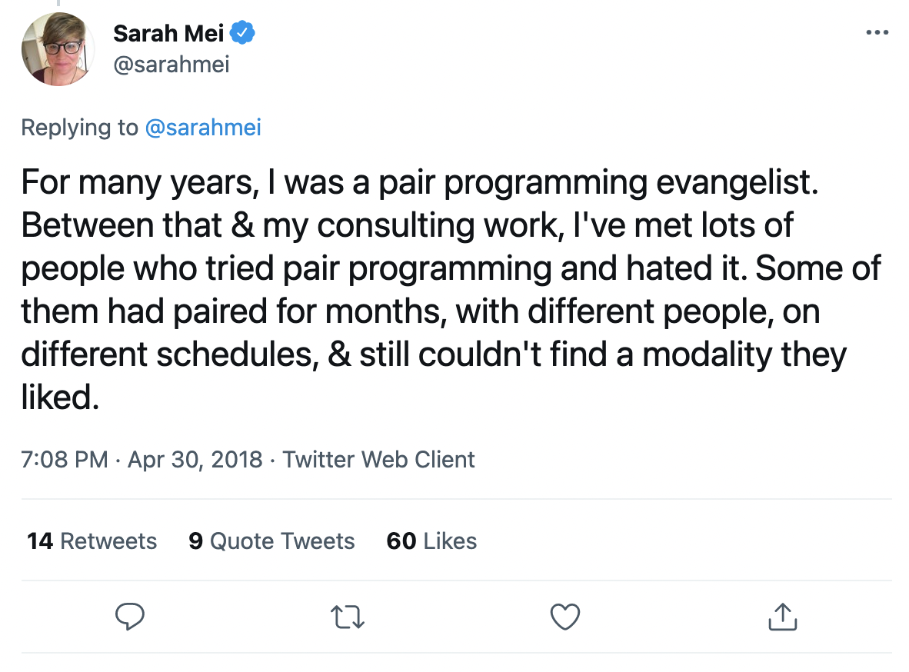

# Pair Programming Workshop

---

## Pre-Work

Read through the [Sigma Labs pair programming documentation](/pairing.md). Make a note of anything you don't understand.

---

## Workshop Length

45 minutes

---

## Learning Objectives

By the end of this session, an attendee should be able to

- Describe how pair programming works at Sigma Labs
- Explain the benefits of pair programming when developing software
- Understand some of the potential challenges of pair programming
- Complete a task in a pair using the strict Driver/Navigator style
- Know how to identify and (to the greatest extent possible) neutralize power dynamics

---

## Materials

- [Sigma Labs pair programming documentation](/pairing.md)

---

# Workshop Details

---

## Pair programming at Sigma Labs Q&A (5 mins)

We'll begin with a short Q&A on anything that you don't understand from the documentation on pair programming. Your questions could be about pair programming in general, or how pairing works at Sigma Labs specifically.

---

## Why pair programming? (Exercise in small groups) (20 mins)

Pair programming is used at top software companies to deliver high quality software. At the same time, pair programming can feel challenging to developers who are used to coding individually. We'll consider why in this exercise.

### Instruction

In your groups, brainstorm as many potential answers as you can to the following questions in turn:

1. Why can pair programming help deliver higher quality software vs. programming individually? (5 mins)
2. Why is pair programming useful when learning to code? (5 mins)
3. What are some challenges or difficulties that might emerge when pair programming? (5 mins)

For the final 5 minutes, each group will feed back their answers to the rest of the class for a brief discussion.

---

## Pairing practice (Exercise in pairs) (10 mins)

Next we'll try a short pairing simulation, to make sure we're all comfortable with how pair programming works.

### Instruction

1. Pick one of your laptops. Open a new VS Code text file on that machine.
2. One of your starts as the **Driver** the other as the **Navigator**
3. The Driver has to write down the following details about the Navigator:

- Where did they go to high school and university?
- What is one thing the Navigator loves?
- What is one thing the Navigator dislikes?
- What is the Navigator's favourite dish or cuisine?
- What kind of music does the navigator like? Do they have a favourite band or artist?
- Does the Navigator have any hobbies?
- Why did the Navigator choose to join Sigma Labs?
- How would the Navigator describe themselves in three words?

4. Write the details out in whole sentences. Remember the Navigator can't touch the keyboard! They have to guide the Driver verbally.
5. After 5 minutes, swap Driver and Navigator. Repeat the above with the roles reversed.

---

## Power dynamics in pairing (Individual exercise) (10 mins)

Let's finish off by considering power dynamics in relation to pair programming. Read this Twitter thread from software engineer & author Sarah Mei:

https://twitter.com/sarahmei/status/990968833547497472

(You should read everything from "For many years, I was a pair programming evangelist." to "That's all I have to say right now".)

Do the following (individually):

- Sarah gives three pieces of actionable advice to help navigate power dynamics when pair programming. Summarize these tips in your own words.
- List out the informal power dynamics you think you'll be most likely to encounter at Sigma Labs.
  - Can you think of a power dynamic where you'd expect to be on the downward side? Can you think of a power dynamic where you'd expect to be on the upward side?
- Think about at least one behaviour you could adopt over the next 3 months to help neutralize power dynamics when pair programming

---
