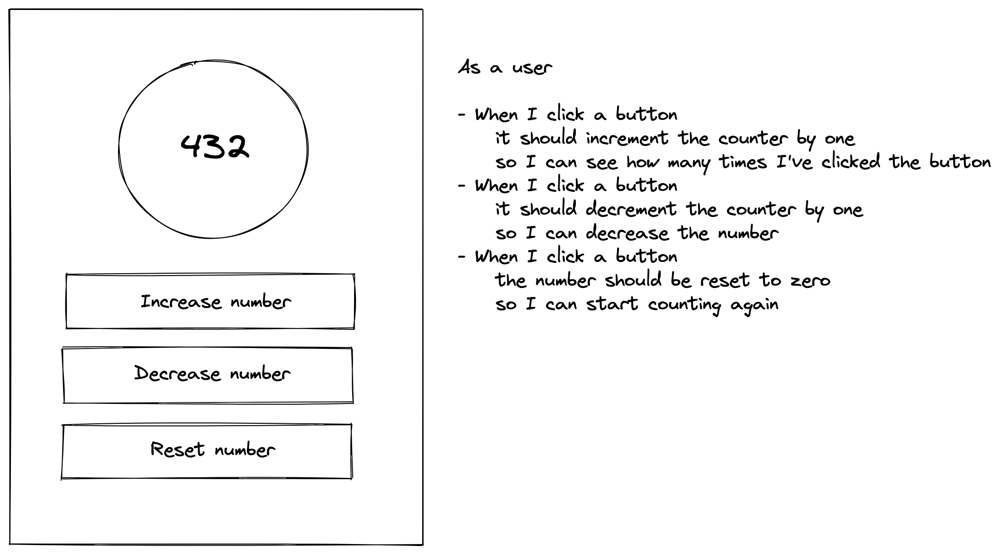

# Writing Tickets

## Learning Objectives

- List the component parts of a user story
- Create a ticket in a Project Management board
- List the different parts of a well specified ticket
- Convert a user story into a ticket

## Workshop

### Lecture

Take this example user story

> As a coffee-drinker, when I click the flat white button on the coffee machine I want it to grind beans and brew a coffee so that I can remain highly caffeinated

Break down the above statement into it's constituent parts

1. `As a coffee-drinker` - The Subject
2. `when I click the flat white button on the coffee machine` - The Action
3. `I want it to brew a coffee` - The Outcome
4. `so that I can remain highly caffeinated` - The Result

Make sure that the 10 user stories fulfill the INVEST criteria:

- **Independent**: The Story should be self-contained, in a way that there is no inherent dependency on another Story.
- **Negotiable**: Stories, up until they are part of an iteration, can always be changed and rewritten.
- **Valuable**: A Story must deliver value to the stakeholders.
- **Estimable**: You must always be able to estimate the size of a Story.
- **Small**: Stories should not be so big as to become impossible to plan/task/prioritize with a certain level of certainty.
- **Testable**: The Story (or its related description) must provide the necessary information to make test development possible.

### Exercise

Brainstorm in a small and write down 5 user stories for one of the following
(or your own) systems:

- WhatsApp
- Facebook
- Gmail
- TransferWise
- A computer game
- A shop that sells custom-made shirts
- Uber
- Etc.

Make sure that all of them are INVESTable

### Exercise

Take a look at the example wireframe and user stories below

Open a trello board and run through the steps to break this town into tickets. Each ticket should have

1. Description
2. Outcomes (or deliverables)
3. Associated User Stories
4. Designs (if required)
5. Time Estimation
