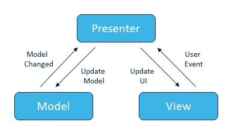

# Client Side Architectures

## Learning Objectives

- Describe the problem that Software Architectures are used to solve
- Write code that follows an MVP architecture pattern
- List competeing archtecture patterns other than MVP
- List the components and describe the functions of the elements of MVP

## Pre-work

No pre-work for this workshop

## Workshop

Ask one of the students (or randomly choose) to share their React code from the previous weeks.

**Note**: Before continuing, make sure you reassure them that the points that you're about to raise **they aren't meant to know**. This is are improvements to their code rather than meaning their code is bad.

Show how the code is

- Very hard to test
- The business logic and the application logic are tightly coupled
- Changing one part of the code meant we touched a lot of other code
- Systemic changes are nearly impossible (imagine if we moved from React to Angular)
- As a newcomer to this code, I have to learn how it works

## Metaphor

Software Architecture (sometimes called Patterns) tries to solve the above problems by giving us a blueprint of how the software is organised.

For example, say we are building fifty houses spread all across the country, built one after the other. The people who build the houses may be different every time but if we use the same engineering decisions every time e.g. we use this type of brickwork, we use this type of roofing type we increase the chance of finding a high skill workman in that area.

Additionally, when we come to check if the houses have been built correctly we know that every house should be following the same specification. If ever house had a different pattern we'd first have to learn how the house was **meant** to be made - then confirm it was made correctly.

## Recap

Spend a few moments recapping 'Separation of Concerns'. Get the students to recall what it is and why it's useful in programming.

## Lecture

For this session we're going to be learning about Model-View-Presenter (MVP).

For an MVP to work it should follow these rules

1. Have good separation of concerns
2. Have a dumb and passive `View` Layer
3. The `Presenter` should be framework-independent
4. `Presenter` should have a 1-1 relationship with the `View`
5. The `Model` controls fetching and organising data

## Live Code

Live Code the below example

https://github.com/Sigma-Labs-XYZ/MVP-Example

You can find a non-MVP example on the branch [`non-mvp`](https://github.com/Sigma-Labs-XYZ/MVP-Example/tree/non-mvp). The finished MVP example can then be found on [`master`](https://github.com/Sigma-Labs-XYZ/MVP-Example/tree/master).
