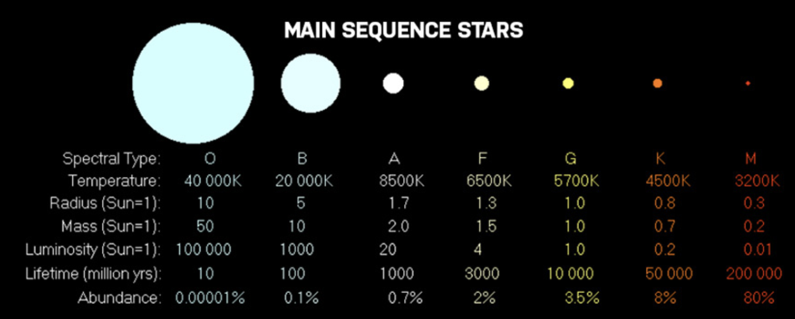

# Intro to OOP

> **We've taught this before!**
>
> See a previous version of this class [here](https://sigmalabs.rewatch.com/video/7784/oop-key-ideas-coding-workshop-may-4-2021/)

## Learning Objectives

By the end of this session, an attendee should be able to

- List the four key concepts of OOP - Encapsulation, Abstraction, Polymorphism, Encapsulation
- Write code that abstracts concepts into classes
- List the built-in types in JavaScript
- Explain the difference between a class and instance
- Understand the role of the constructor function
- Use the `this` keyword to read and write properties
- Add a method to a class they've defined

## Pre-work

### 1. Research

Before attending this workshop, make sure you have an answer to the following questions

1. What does it mean that JavaScript has built-in types?
2. What are the JavaScript built-in types?

You'll be tested on these questions in the session.

### 2. Research

**Setup:** If it hasn't been done already, create a thread of Slack titled "OOP Research Project"

Prepare a 100-200 word description of what Object Oriented Programming is and what problems that solves. You are welcome to use bullet points if you'd prefer.

When you've completed it, share it in the thread on Slack.

## Workshop

### Metaphor

Why does OOP exist?

- When we write code we're trying to model the real world
- But when we look at the world it isn't made of `strings`, `numbers`, `arrays` etc
- It's made of things e.g. `tables`, `chairs`, `walls`, `lights`
- This is one of the problems that OOP tries to solve - a better way to model the real world

### Theory

There are four key aspect to OOP - you can remember them as `A PIE`

- **Abstraction** - A model or representation of an object that we can use again and again. This is the opposite of an implementation.
  - e.g. a recipe for a basic pie
- **Polymorphism** - A set of shared qualities or methods that objects share.
  - e.g. we can change the contents of a pie without changing our pie recipe itself
- **Inheritance** - The relationship that objects have to each other where one `extends` the other
  - e.g. The relationship between a basic pie recipe and an apple pie, a raspberry pie etc
- **Encapsulation** - Everything has private details that other code shouldn't ever know about.
  - e.g. I shouldn't have to know how the pie is made to be able to use it.

### Live Code

Convert this `function` into a `Class`

```js
function createCar(
  isLeftHandDrive,
  passengerNumber,
  fuelTankSizeInGallons,
  milesPerGallon,
  maxNumberOfWheels
) {
  let car = {}
  car.isLeftHandDrive = isLeftHandDrive
  car.passengerNumber = passengerNumber
  car.fuelTankSizeInGallons = fuelTankSizeInGallons
  car.milesPerGallon = milesPerGallon
  car.maxNumberOfWheels = maxNumberOfWheels
  car.calculateMaxDistance = function () {
    return this.fuelTankSizeInGallons * this.milesPerGallon
  }
  return car
}

console.log(createCar(false, 5, 12, 25))
```

Next,

1. Create a `Wheel` class that has the properties `rimRadius` and `maxAirPressure`.
2. Create an array of Wheels
3. Create a new method in `Car` to add Wheels
   1. This should throw an error if too many wheels are added

There are five key concepts to cover here

1. `class` keyword
2. `contructor` function
3. `function` syntax
4. `this` keyword
5. `new` keyword

### Exercise

Let's try modelling something ourselves next. Let's start small, so we can model a solar system. 🌌

1. We want to create a `SolarSystem` class that will house all of our solar entities.
2. This will need to contain two properties: a `stars` property, and a `planet` property, containing an array of stars and planets respectively.
3. There should be two methods, `addPlanet()` and `addStar()` which allows us to add planets and stars to our solar system.
4. Create a `Star` class.
5. This will contain properties about the star: `name`, `mass` and `temperature`.
   _Note: the mass of the stars should be consistent! In the example I used the metric for mass based off how many suns the star weighs. The temperature should be in Kelvin._
6. Create a method called `calculateClassification`. This will return the letter classification of the star based off the temperature and the mass. The chart below can be used for this:



7. Create a `Planet` class. This should contain two properties: `name` and `radius`.
8. The `Planet` class should contain a get method called `circumference()` which returns the circumference of the planet.
9. Make it so that we can generate stars and planets with randomly generated properties.

For example, calling the following code:

```js
const newPlanet = new Planet()
```

Will look something like this:

```js
  Planet {
    name: "_os045bjed",
    radius: 9208
  }
```

Here are two useful functions that will help you.

```js
function getRandomNumber(min, max) {
  min = Math.ceil(min)
  max = Math.floor(max)
  return Math.floor(Math.random() * (max - min + 1)) + min
}

function generateId() {
  return '_' + Math.random().toString(36).substr(2, 9)
}
```

10. Populate the solar system with a random number of planets and stars.

11. Answer the following questions:

- What's the smallest planet in terms of circumference?
- What's the name of the heaviest star in the solar system?
  - How heavy is it?
  - What is its classification?

The output should look something like:

```text
The heaviest star has the mass of 59 suns. It is called _phr9hmt0t and has a classification of A.
The circumference of the smallest planet is 5863km.
```

#### Above & Beyond

1. Name your stars using the names of real stars chosen randomly from this [file](https://github.com/PirtleShell/constellations/blob/master/constellations.json).
   1. You can copy and paste them into your JavaScript file
2. Create a class `Moon` that orbits planets.
   1. A planet can have multiple moons. Randomly populate planets over a circumference of 10000km with moons.
   2. Calculate an orbit based off the distance to the planet.
