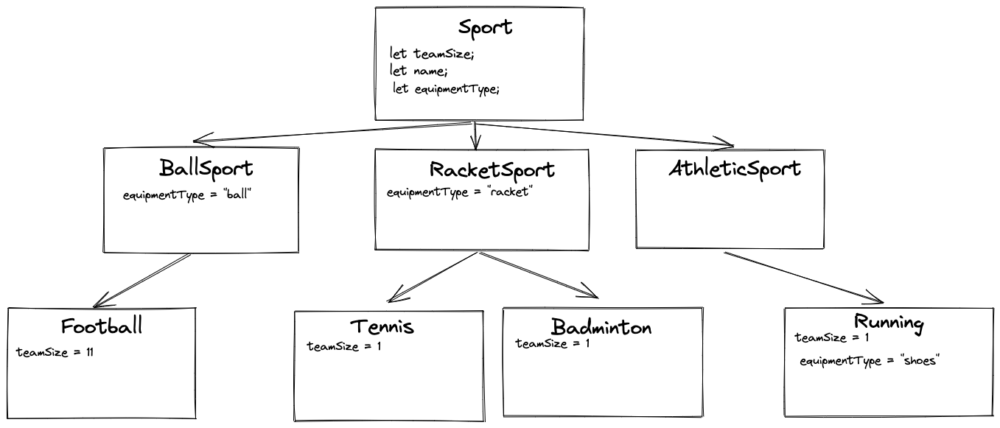

# Inheritance

> **We've taught this before!**
>
> See a previous version of this class [here](https://sigmalabs.rewatch.com/video/7846/inheritance-coding-workshop-may-5-2021/)

## Learning Objectives

By the end of this session, an attendee should be able to

- Explain what inheritance is conceptually using real-world analogies
- Implement inheritance in JavaScript using the `extends` keyword
- Understand the limits of inheritance
- Add an instance field to a class using [the shorthand syntax](https://developer.mozilla.org/en-US/docs/Web/JavaScript/Reference/Classes/Public_class_fields)
- Use polymorphism to refactor and DRY up repetitive code

## Pre-work

### 1. Research

Spend some time learning about what "inheritance" is in

1. Object Oriented Programming
2. In modern JavaScript (using the class and extends keywords)

To get your started, here is a good video from [The Coding Train](https://www.youtube.com/watch?v=MfxBfRD0FVU).

### 2. Create

Using the concepts behind inheritance and using `extend` and `super` create a set of JavaScript classes that are an implementation of the following diagram.

Arrows describe the relationship between the classes.



## Workshop

### Pop Quiz (5 mins)

<details>
    <summary>Do not open before class</summary>
    
 1.  What are the four principles of OOP? (Remember, A PIE)
 2.  What should you not do if you see a `_` prefixed to a method in a class?
 3.  How to you declare a private variable in a class?
 4.  What needs to change to make this code work?
     ```
     class Ball{
         constructor(color){
             this.color = color;
         }
         throwBall(){
             console.log("Go long!")
         }
     }

     Ball.throwBall()
     ```

5.  What needs to change to make this code work?
    ```
    const ball = new Ball("red")
    if(ball === Ball){
        console.log("This is an instance of a ball!")
    }
    ```
6.  Write a line of code that will throw a `TypeError` with the message "You can only throw a ball"

</details>

### Live Code

In this section we're looking to introduce

- The `extend` keyword
- The `super` keyword

Continue the `PetStore` exercise from yesterday and add

1. An `Animal` class
2. Extend `Dog` to extend `Animal`
3. Create a `Cat` that extends `Animal`
4. Update our `PetStore` to accept `Animal`s instead of `Dog`s
5. Update our `Cat` and `Dog` methods to use `speak()` instead of `bark()`/`meow()`

### Live Code

Next, implement the pre-work exercise. Be sure to mention the use of `super()` to pass parameters up to the parent class.
