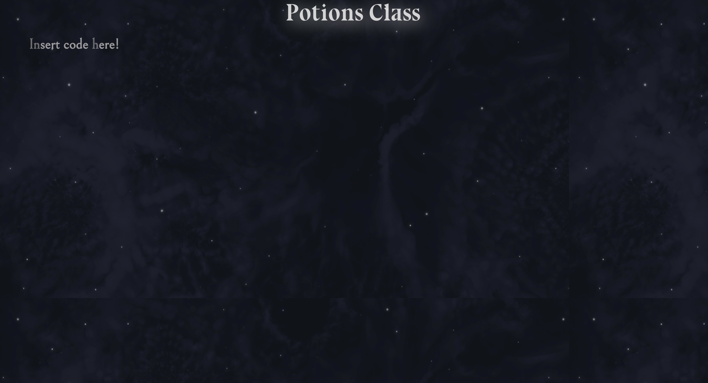

# Frontends II: Frameworks <!-- omit in toc -->

## Contents <!-- omit in toc -->

- [Learning Objectives](#learning-objectives)
- [Previous Sessions](#previous-sessions)
- [What is a Front End Framework?](#what-is-a-front-end-framework)
- [Resource: Learn React on Scrimba](#resource-learn-react-on-scrimba)
- [Challenge 1: Recreating your CV](#challenge-1-recreating-your-cv)
  - [Getting Setup](#getting-setup)
  - [Intro to JSX](#intro-to-jsx)
  - [Task](#task)
- [Challenge 2: Hogwart's Student Registry](#challenge-2-hogwarts-student-registry)
  - [Getting Setup](#getting-setup-1)
  - [Setting Up Our App](#setting-up-our-app)
    - [Create our page layout](#create-our-page-layout)
    - [Display the Register](#display-the-register)
    - [Create a Form to Register New Students](#create-a-form-to-register-new-students)
  - [State](#state)
    - [Getting and Setting State](#getting-and-setting-state)
    - [Using EventListeners to Add New Students](#using-eventlisteners-to-add-new-students)
  - [Components](#components)
    - [Create a register](#create-a-register)
    - [Example: Using a Component](#example-using-a-component)
  - [Props](#props)
    - [(Re)-displaying Students in the `Register` Component](#re-displaying-students-in-the-register-component)
    - [Create individual student cards](#create-individual-student-cards)
    - [Create a component for the registration form](#create-a-component-for-the-registration-form)
  - [Callback Props](#callback-props)
    - [Update the student list using a callback prop](#update-the-student-list-using-a-callback-prop)
  - [Final Touches](#final-touches)
    - [Add house badges](#add-house-badges)
    - [Update the app styling](#update-the-app-styling)
    - [Change house selection to a dropdown menu](#change-house-selection-to-a-dropdown-menu)
- [Challenge 3 - React Testing](#challenge-3---react-testing)
  - [Jest & React Testing Library](#jest--react-testing-library)
    - [Setup](#setup)
    - [Our First Jest Test](#our-first-jest-test)
  - [Introducing React Testing Library](#introducing-react-testing-library)
  - [Tasks](#tasks)
- [Above & Beyond](#above--beyond)
  - [Additional Functionality](#additional-functionality)
  - [React Hooks](#react-hooks)

## Timetable <!-- omit in toc -->

| Time                | Focus                                                                                                                                                                                                                                                                                                                                   |
| ------------------- | --------------------------------------------------------------------------------------------------------------------------------------------------------------------------------------------------------------------------------------------------------------------------------------------------------------------------------------- |
| Monday morning      | Begin [Challenge 1](#challenge-1-learn-react-on-scrimba), install React, learn about props, states, components and JSX                                                                                                                                                                                                                  |
| Monday afternoon    | Continue [Challenge 1](#challenge-1-learn-react-on-scrimba), continue working on Scrimba                                                                                                                                                                                                                                                |
| Tuesday morning     | Complete [Challenge 1](#challenge-1-tic-tac-toe-in-react), implement the suggested extension to the official tutorial                                                                                                                                                                                                                   |
| Tuesday afternoon   | Begin [Challenge 2](#challenge-2-hogwarts-student-registry), implement listing and deleting students                                                                                                                                                                                                                                    |
| Wednesday morning   | Complete [Challenge 2](#challenge-2-hogwarts-student-registry), implement adding students                                                                                                                                                                                                                                               |
| Wednesday afternoon | Begin [Challenge 3](#challenge-3---react-testing), learn about react testing                                                                                                                                                                                                                                                            |
| Thursday morning    | Complete [Challenge 3](#challenge-3---react-testing), write your own React Tests for your Hogwarts school registry                                                                                                                                                                                                                      |
| Thursday afternoon  | Take the [Week 4 Mastery Quiz](./quiz.md).                                                                                                                                                                                                                                                                                              |
| Friday              | **If you scored more 9 or more in the Mastery Quiz** - Congratulations 🎉! You've mastered the concepts for this week. You can move on to the Above & beyond challenges.                                                                                                                                                                |
|                     | **If you scored less than 9 in the Mastery Quiz** - Take the time you need to review the concepts you're unsure about (the guidance in the Quiz answers will point you to the materials to review). Once you're comfortable with all the concepts in the quiz, you can move on to the Above & beyond challenges for any remaining time. |

## Learning Objectives

By the end of this week a learner will be able to

- Describe the problem that front end frameworks are trying to solve
- Accurately recall the React component lifecycle
- Create a React frontend app with create-react-app
- Use yarn to add dependencies to a node project
- Use yarn to run a React app
- Create a react component that returns a HTML element
- Pass props to a React component from another
- Pass a function as a prop to a React component to act as a callback
- Access props from inside a react component
- Use a state object to store the current state of a React component
- Use setState() to update the state of a React component
- Use map to convert a JS object into a React component or HTML element
- Use the spread operator
- Choose when code is executed depending on the lifecycle state of the component
- Write unit tests using `jest` and `react-testing-library` to test individual components
- Write a unit test that confirms is an element is present using `jest`
- Write a unit test that triggers a button click using `jest`
- Write a unit test that tests that an element returns the correct HTML based on the props given

## Previous Sessions

You can find the previous recorded sessions of this week here on Rewatch

- [Cohort 1 Workshops](https://sigmalabs.rewatch.com/collection/789/week-8-frontend-frameworks-react) (Note: This week has changed since it was run in this session)

## What is a Front End Framework?

> We've taught this before!
>
> Checkout a previous version of this workshop here:
>
> - [Intro to React Workshop](https://sigmalabs.rewatch.com/video/p5rz8ou7ouwfwstg-intro-to-react-coding-workshop-june-14-2021)
> - [Dependency Management Workshop](https://sigmalabs.rewatch.com/video/7m1fdtnjh8am35dd-dependency-management-yarn-optional-coding-workshop-june-14-2021)
>
> You can find the rest of the week's content [here](https://sigmalabs.rewatch.com/collection/789/week-8-frontend-frameworks-react)

In Week 3, we used basic JavaScript running in the browser (i.e. on the frontend) to make our pages more interactive. We used built in functions like `querySelector()`, `appendChild()`/`removeChild()` and `addEventListener`.

We can get a lot done using these built in functions, in fact some large real world apps do just this. However, things can get complicated if we try building more complex applications using this approach. For example, `appendChild` is very convenient if we want to a single element (e.g. an `<li>` in a list, as in Week 3), but what if we were creating, say, a calendar app:


How many elements are contained in the popup? (Hint: it's certainly several dozen). We might have to make an individual call to `appendChild` (or similar) for each element. In addition, some of these elements are interactive (e.g. the "Add Google Meet video conferencing button"), so we'd need to attach event listeners dynamically (and clean them up if the popup is closed!). This one interaction could lead to a lot of complex code.

What's more, look at what happens if I fill in the details on the invite:


Once I fill in the title of the event, it changes on the block representing the event. If I change the date, the block and popup move (with a nice animation). This kind of complex interaction between parts of our page is nontrivial to implement, especially only using JavaScript's simplest functions.

In short, we'll quickly run into problems if our apps require:

- Creating/destroying complex components containing multiple HTML elements
- Handling events for these components (especially as they might appear or disappear)
- Updating components when our data changes (data binding)
- Allowing nuanced interactions/communication between components

There are some more recent built-in tools (like the `<template>` tag) that can help with these issues, and many small 3rd party libraries that tackle individual problems (e.g. [Rivets](http://rivetsjs.com/) for data binding). Alternatively, we have **JavaScript frameworks** which provide opinionated solutions to all the problems commonly associated with creating complex web applications.

This week we'll be looking at React, the most popular JS framework at the time of writing. It's worth noting that although other popular frameworks (e.g. Vue, Angular, Svelte) have differences, they're not that dissimilar from React. Having learnt one frontend framework, the learning curve to become familiar with others isn't terribly steep.

## Resource: Learn React on Scrimba

To get you started, we're going to use Scrimba to teach us the basics of React.

Scrimba is one part video series, one part interactive code editor and one educational tool. It's really good.

Some notes to keep in mind when working on Scrimba:

1. If you are completing a section, do **not** skip the challenges, practices or when the presenter asks you to pause and write code. **This is where the learning happens**.
2. Consider watching in greater than `1x` speed if you want to (click the ⚙️ icon)
3. You should **not** watch past Lesson 45.
4. Feel free to pick and choose topics that you are unsure on. There is no need to watch the entire course, and it can be used as a guide to aid learning.

The course can be found here:

https://scrimba.com/learn/learnreact

You are also welcome - and encouraged - to use any other online resources that you like.

## Challenge 1: Recreating your CV

From our challenge last week, we'll be implementing our CVs again using React.

### Getting Setup

To get started we're going to use `create-react-app` to create a React Application for us called 'react-cv'. You should follow the instructions here:

https://create-react-app.dev/docs/getting-started/

You'll know this is working when you've got a React Project in a folder. Next you should,

- Open a terminal window
- Navigate into your react app directory (i.e. using `cd`)
- Run `yarn install`
- Run `yarn run`

Your browser should automatically open to http://localhost:3000 and you should see something like the below:


### Intro to JSX

1. When you have completed the setup, remove the `<App/>` in `index.js`

2. Replace the `<App/>` with a "Hello World!" message in `<h1>` tags, to ensure your setup is working as expected:

```jsx
// index.js
import React, { Component } from 'react'
import ReactDOM from 'react-dom'
import './index.css'

ReactDOM.render(<App />, document.getElementById('root'))
```

2. You should create an `index.css` file in the same directory as `index.js`.

3. Update the CSS to reflect your favourite colour. This can be through changing the font colour or background colour.

Take a look again at `index.js` above. The contents of the parentheses after the `return` statement is JSX, which we encountered in the last challenge. With JSX, we can write what looks like HTML, and also we can create and use our own XML-like tags. Here's what JSX looks like assigned to a variable:

```jsx
const heading = <h1 className="site-heading">Hello, React</h1>
```

Using JSX is not mandatory for writing React. Under the hood, it's running `createElement`, which takes the tag, object containing the properties, and children of the component and renders the same information. `React.createElement` is quite similar to the built-in [`createElement` method](https://developer.mozilla.org/en-US/docs/Web/API/Document/createElement) we encountered in Week 3. The below code will have the same output as the JSX above:

```jsx
const heading = React.createElement(
  'h1',
  { className: 'site-heading' },
  'Hello, React!'
)
```

JSX is actually closer to JavaScript, not HTML, so there are a few key differences to note when writing it.

- `className` is used instead of class for adding CSS classes, as class is a reserved keyword in JavaScript.
- Properties and methods in JSX are `camelCase` - `onclick` will become `onClick`.
- Self-closing tags must end in a slash - e.g. ``
- JavaScript expressions can also be embedded inside JSX using curly braces, including variables, functions, and properties:

```jsx
const name = 'Sigma'
const heading = <h1>Hello, {name}</h1>
```

JSX is easier to write and understand than creating and appending many elements in vanilla JavaScript. Thus, React effectively tackles one of the challenges we highlighted at the start of the week: "Creating complex components containing multiple HTML elements".

### Task

Recreate your CV from last week's challenge in `react-cv/src/index.js`.

1. Convert your structural HTML elements into JSX and update the `render()` function to reflect this.
2. Copy the CSS from last weeks challenge into `react-cv/src/index.css` to maintain the styling.
3. Compare your vanilla JavaScript project from Week 3 and the React version.
   Open the elements tab of your React app, and compare this to the HTML for your work in week 3. Are there any differences?

## Challenge 2: Hogwart's Student Registry

Next we'll make a simple student registration app for the world's favourite fictional school: Hogwarts!

For reference, a live version of this challenge is deployed here: [Potions Class](https://sigma-labs-xyz.github.io/week-4-potions-class/)

### Getting Setup

Download the skeleton app `/potions-class` and run `yarn install` and `yarn start`

Your loaded page should look like this ⬇️



### Setting Up Our App

#### Create our page layout

So we now have our skeleton code up and running. We now want to structure our React app by creating different sections to hold our features.

After this section we won't have anything visible on our page, but we will add to it in the subsequent sections.

**Tasks**

1. Import the dummy data `hogwartsStudentRegistry`from `/data.js`.
2. Create two `div`s in `src/App.js` using JSX, one for the left hand side of the page and one for the right hand side column. The left hand side should have an `className="app-lhs-container"` and the right hand side should have `className="app-rhs-container"`.
3. Create a `div` in the `app-lhs-container` with `className="form-wrapper"`. This will contain your form for creating new students.
4. Create a `div` in the `app-rhs-container` with `className="register-wrapper"`. This will contain your register listing your students.

#### Display the Register

Now that we have our page layout all set up, we want to use the student data that we imported to display our class register.

**Tasks**

1. Display the names, houses of students and time of entry in the data file in a `register-list` div.
   - _Hint: use `map()` to return multiple records._
   - This should look something like this ⬇️


#### Create a Form to Register New Students

We can see our class register! But now we need to add students to it, in case they're not in the data file. We can do this by creating a form that takes some input.

The information we would need to register a student is their name and their house.

**Tasks**

1. Create a form with `className="attendance-form"` in `App.js`.
2. The form should have two text inputs and a submit button.
   - All elements in the form should have `className="form-item"`
   - The text `input` fields should also have a `className` called `form-field`
   - The `submit`button should also have a `className` of `submit-btn`.

_Hint: Don't forget labels for your form fields!_

This should now look something similar to this ⬇️


---

### State

Right now, we're storing our student data in an array in a variable, and passing it through as `props`. This is good to start, but imagine if we want to be able to delete an item from the array. Using `state` we can update private data from a component.

You can think of `state` as any data that should be saved and modified without necessarily being added to a database - for example, adding and removing items from a shopping cart before confirming your purchase.

To start, we're going to create a `state` object.

```jsx
// src/App.js
class App extends Component {
  constructor(props) {
    super(props)
    state = {}
  }
}
```

The object will contain properties for everything you want to store in the state. For us, it's `students`.

```jsx
// src/App.js
class App extends Component {
  constructor(props) {
    super(props)
    state = {
      students: []
    }
  }
}
```

#### Getting and Setting State

To retrieve the state, we'll be using `this.state.students`, which is an ES6 method.

```jsx
// Access the state
printAState = (newValue) => {
  console.log(this.value.state)
}
```

To update the state, we'll use `setState()`, a built-in method for manipulating state.

Simply applying a new value to `this.state.students` will not work:

```jsx
// THIS WILL NOT WORK
updateAState = (newValue) => {
  const { value: oldValue } = this.state // this is the previous value taken from state
  this.state.value = newValue
}
```

Instead, you must use `this.setState()` to modify the state.

```jsx
// DO THIS
updateAState = (newValue) => {
  const { value: oldValue } = this.state // this is the previous value taken from state
  this.setState({
    key: newValue
    })
  })
}
```

Note that we are putting our key-value pair in an object, and passing this as a parameter to `setState()`. This is because our state is an object! This will not change the whole state, only the keys defined in `setState`.

---

#### Using EventListeners to Add New Students

Now we understand state a bit better, we can use this to further populate our registry. We have a form that takes an input, and it is up to us to track these inputs and create a new student to add to the register.

In React we have to track the values of the input fields in the form, and only ever use those values when submitting the form. This is different to in plain JavaScript which allows us to take these values through `document.getElementById('idOfInput').value` or `event.target.value`.

Look through the documentation below to better understand how React deals with form inputs.

**Tasks**

1. Change the initial state to include `hogwartsStudentRegistry` that we imported earlier.
2. Update the `state` of `App.js` whenever a new student is entered, also being sure to add a variable of the time registered. Make sure the most recently registered students are displayed at the top!
   - _**Hint**: look at the following docs on [the change event](https://developer.mozilla.org/en-US/docs/Web/API/HTMLElement/change_event), [onSubmit](https://developer.mozilla.org/en-US/docs/Web/API/GlobalEventHandlers/onsubmit), [preventDefault](https://developer.mozilla.org/en-US/docs/Web/API/Event/preventDefault), and the [React.js docs for Forms.](https://reactjs.org/docs/forms.html)_
3. Use the `state` to render the updated list of students.

   This user story should work as shown below:

   

---

### Components

So far, we've created one component - the `App` component. Almost everything in React consists of components, which can be defined as classes or functions.

Take a look at the `App.js` file. The last line in the file is

```js
export default App
```

And now look at the `index.js` file.

- What is different about the `render()` function in the index file?
- How do we create an instance of the `App` component?

When we use `create-react-app`, both `index.js` and `App.js` are created.

This is because `index.js` is the traditional entry point for all node apps, which means it has the code of what to render to the application, and where.

`App.js` has the root component of the React app, which means it is at the top of the hierarchy.

It's not mandatory to separate components into files, but an application will start to get unwieldy and out-of-hand-if you don't.

_Note: You don't need to necessarily use `App.js` as it is just another component, but it is common practice to separate the two rather than directly using `index.js`._

**Exercise**

Before moving on, review the [Scrimba course on Components](https://scrimba.com/learn/learnreact).

---

#### Create a register

Now that we understand Components, let's create a Register component so that we have somewhere to render all of the students that have attended class.

For now, this component will be empty but we'll work to populate it with data in the next step.

**Tasks**

1. Create a React component called `Register` in a file called `Register.js`.
2. Create a `render()` function that will return our JSX.
3. Set the `className` of the parent container `register-wrapper`. This is so it matches the `App.css` file.
4. Change the JSX of the component so that it matches our register from `App.js`.
5. `export` the component as `Register` in `Register.js`.
6. In `App.js` import `Register`. You can now replace the previous `register-wrapper` div with the new component.

_Note: there **shouldn't** be anything displayed in your register after completing this stage. This is expected behaviour!_

---

#### Example: Using a Component

```js
// ExampleComponent.js

import React, {Component} from 'react'

class ExampleComponent extends Component {
  render() {
    return (
      // JSX
    )
  }
}

export default ExampleComponent
```

```js
// App.js
import ExampleComponent from 'ExampleComponent.js'
...
render() {
  return(
    <ExampleComponent/>
  )
}
```

---

### Props

A prop is a property that can be passed into a component. This can be variables or functions, and are accessed in a similar way to state.

**Task**

- Watch this [tutorial](https://www.youtube.com/watch?v=PHaECbrKgs0) on React `props`.
- Revise the [React docs on props](https://reactjs.org/docs/components-and-props.html) and [this cheat sheet](https://www.freecodecamp.org/news/react-props-cheatsheet/.)

Remember that you have to explicitly pass in `props` as well as calling `super(props)` in your child component constructor.

If you have passed in props, you should not use these to set a state.

     ```js
     // DO NOT DO THIS
     constructor(props) {
       super(props)
       this.state = {
         students: this.props.students
       }
     }

     function printStudents() {
       console.log(this.state.students)
     }
     ```

     Instead, you should use the props directly.

     ```js
     // DO THIS
     constructor(props) {
       super(props)
     }

     function printStudents() {
       console.log(this.props.students)
     }
     ```

---

#### (Re)-displaying Students in the `Register` Component

Now that we have moved our `Register` to a new component, our students are no longer displayed. We need to use `props` to pass in the information our child component needs.

**Tasks**

1. Pass in the student list from `App.js`to the `Register` component by creating a prop.
2. Use props in the `Register` component to display all of the students as before.

#### Create individual student cards

In our `Register` component we want to create an individual card for each student. This makes it much easier to control the data displayed and so the styling of each card can be consistent and clear to see in our code.

**Tasks**

1. Create a component `Student` in `Student.js`
2. Change the `render()` function to return an an individual card
3. In the `Register` component, update the JSX to render a `Student` component for each student, forming a card.
4. Pass in the necessary props for each student in `Register.js`
5. Update `Student.js` to display the student information in an individual student card using props.

#### Create a component for the registration form

As we created a component for our register, we now want to do the same for the form. We want to keep our `App.js` as simple as possible as it is the highest parent component.

It is important to note that after completing this, the functionality will no longer be the same as our student list is in the parent and not the child! We'll be using `props` to fix this in the next section.

**Tasks**

1. From `App.js`, extract the form div into a new component `StudentForm`.

---

### Callback Props

A callback prop is a function that can be passed into a component. The component can then call this function like a callback - hence the name callback prop! You usually use these for event handlers or for updating state in a parent component.

When you pass a function to a component, you are actually passing the _reference_ for the function, and not the function itself. This is why it is important to **bind** the function to the component instance.

There are several ways of binding, which can be highlighted in the React docs page for [Passing Functions to Components](https://reactjs.org/docs/faq-functions.html).

**Exercise**

Read the above article: [Passing Functions to Components](https://reactjs.org/docs/faq-functions.html)

You pass in callback props exactly how you would for a variable prop, and also use it in the same way, except calling the method when declaring it.

```js
  // Parent component
  import Child from 'Child.js'

  class Parent extends React.Component {
    constructor() {
      this.state = {
        importantMessage: 'This is an important message!',
        ...
      }
      // one of the ways of binding to a component instance
      this.updateImportantMessage = this.updateImportantUpdate.bind(this)
    }

    updateImportantMessage(newMessage) {
      // Use callback props to update the single source of truth.
      // In this case there can only be one important message!
      this.setState({
        importantMessage: newMessage
      })
    }

    render(){
      const {importantMessage} = this.state
      return (
        // updateMessage is the reference that Child receives.
        // This is the reference that you would use in the child component when using a callback prop
        // this.updateImportantMessage is the reference to the function itself
        <Child updateMessage={ this.updateImportantMessage }/>
        <h1>This is a very important message: {importantMessage}</h1>
      )
    }
  }
```

```js
  // Child component
  class Child extends React.Component {
    constructor(props) {
      super(props)
      this.state = {
        currentText: ''
      }
    }

    handleTextInput = (e) => {
      // update the state of the changing message that the user can input
      this.setState({currentText: e.target.value})
    }

    handleClick = (e) => {
      // when we click the update button, we can use props to send our information
      // to the parent component by calling the prop function passed in
      this.props.updateMessage(this.state.currentText)
    }

    render(){
      const {importantMessage} = this.props
      return (
        <div id="child-component-container">
          <input type="text" onChange={this.handleTextInput}></h1>
          <input type="button" onClick={this.handleClick} value="Update the important message!"/>
        </div>

      )
    }
  }
```

---

#### Update the student list using a callback prop

Since separating the form into a child component of `App.js`, we can no longer directly change the `state` in our `App` component. We can work around this using callback props, so we can take our form input and feed it into our parent, `App`, to then update the student list in the `state`.

Use `console.log()` to see if the `state` of `App` is being correctly updated.

**Tasks**

1. Using a callback prop, update the student list in App.js with the newly entered student information.
   - Hint: you should only have one `students` state (a single source of truth) in `App.js`.

### Final Touches

#### Add house badges

Now we have our register displayed and a form that allows us to register new students, we now want to add some final touches to our project. We'll start with adding house badges to each student card.

**Tasks**

1. Add badge images to the card corresponding to the house. These images can be found in the `hogwarts-img` folder and can be created with `className = "student-record-house-badge"`.

   This should look something like this ⬇️

   

#### Update the app styling

To match the styling of the deployed application, we can take a look at the App.css file to see the different components and the styling applied to them. Try to add in `className` or `id` to the applicable HTML elements to match the styling of the deployed app.

**Tasks**

1. Update the styling of the page to match the CSS provided in `App.css`

   - Hints: look at the structure of the CSS and feel free to explore the elements in the [example app](https://sigma-labs-xyz.github.io/week-4-potions-class/). The `App.css` file also should be helpful.
   - Tip: to create the register header with the star background, use a div with `id = "register-component-header`" `<span>` and `<h2>` for the fonts. Feel free to use any emoji instead of a star!

   This will now look as shown below ⬇️

   

#### Change house selection to a dropdown menu

We are currently accepting a text input for our 'House' field, but this can cause problems if there are students inputting houses that don't exist! For this reason, we can change our text input into a drop down menu that allows for the house options.

If a student is undecided, we can also sort them too!

**Tasks**

1. Replace the text input for House in the form with a drop down menu.
   - Hint: look at [these docs](https://reactjs.org/docs/forms.html#the-select-tag) for React and the `<select/>` tag.


2. Add a house option to 'Sort Me!', which allows you to be randomly assigned a house.


## Challenge 3 - React Testing

In the previous weeks of the course you should have been writing test to confirm that the code you're writing is correct.

A similar approach can be taken in React but we have to be careful to separate our code into discrete units

1. Business Logic and
2. Application Logic

Business logic is logic that is to do with what the business does. If business expert says that "Customer cannot withdraw more money than he has in his account.", then this is a business rule. In ideal world, this logic would be in some kind of library or service, so it can be either reused across multiple applications or changed in all relevant applications at once.

Application logic is simply everything else. Example can be "clicking this button opens window to add new customer". It has nothing to do with business, but it is still logic that needs to be implemented. In ideal world, application logic will use library or service, that is implementing the business rules. Multiple application, each with different application logic, can reuse one business logic. In our case, our React App is our Application Logic since it is what decides what is shown where and when in the browser.

If we were testing only Business Logic then we'd be able to test our code in the same way that we've been doing so in the previous weeks. However, to test our Application Logic - in this case our React Components - we'll have to learn some new skills.

### Jest & React Testing Library

To achieve testing of our React Components we'll have to learn two new tools. A general testing framework and - [Jest](https://jestjs.io/) - and a tool set built for testing React - [React Testing Library](https://testing-library.com/docs/react-testing-library/intro/).

#### Setup

Let's begin with Jest!

Let's go ahead and install jest now. You can do this by writing this command from your app directory.

```sh
yarn add --dev @testing-library/jest-dom
```

Next, create a file called `babel.config.js` in the same directory as your `package.json` that contains this

```js
module.exports = {
  presets: [
    ['@babel/preset-env', { targets: { node: 'current' } }],
    ['@babel/preset-react', { targets: { node: 'current' } }] // add this
  ]
}
```

Jest is very similar to the tests that you've been writing previously but with slightly different syntax. If we took an example test from Week 1

```js
Deno.test('pointsFor(): empty hand', () => {
  assertEquals(pointsFor([]), 0)
})
```

This test could be written with Jest with

```js
describe('Calculate Points', () => {
  test('Empty Hand', () => {
    expect(pointsFor([])).toBe(0)
  })
})
```

#### Our First Jest Test

In your Hogwarts Project, you should have a file called `App.test.js` in your `src` folder. If you don't, make one now.

```js
test('One plus one should equal two', () => {
  expect(1 + 1).toBe(2)
})
```

Copy the above code into the project and run `yarn test`. You should see the following output:

```markdown
PASS src/App.test.js
✓ 1+1 (1 ms)

Test Suites: 1 passed, 1 total
Tests: 1 passed, 1 total
Snapshots: 0 total
Time: 0.625 s, estimated 1 s
Ran all test suites related to changed files.
```

Success! 1+1 does in fact equal 2! ✅

### Introducing React Testing Library

The above style of test when you have independent functions that are easy to test. For example:

- Does this function return a string in the correct format?
- Does this function calculate a number correctly?
- Does this function create JSON in the correct format?
- ...

This gets much harder when trying to test React components such as

- Does this component render all of the data to the browser correctly?
- Does this component handle user input properly?
- Does this component update state correctly when data is received?
- ...

Fortunately, we can use a handy library called "Testing Library" to assist us in this pursuit. In particular we'll be using their [React Library](https://testing-library.com/docs/react-testing-library/intro).

We can install this library by running this command

```sh
yarn add --dev @testing-library/react
```

As an example, we might want to check that the Form exists as a component we might first improve Testing Library with these commands

```js
import React from 'react'
import { render, screen } from '@testing-library/react'
import '@testing-library/jest-dom/extend-expect'
```

Then import our form component

```js
import Form from './Form'
```

Then write our test and add a `screen.debug()` so that we can see our component when our test runs.

```js
describe('Form', () => {
  test('renders Form component', () => {
    render(<Form />)

    screen.debug()
  })
})
```

Now, run `yarn test` and we should see one passing test!

What might be more useful is that we test that an element that we expect to be in the form - say an input - is present.

We could do that like this:

```js
describe('Form', () => {
  test('renders Form component', () => {
    render(<Form />)
    screen.debug()
  })

  test('Form contains input', () => {
    render(<Form />)
    expect(screen.getByRole('textbox')).toBeInTheDocument()
  })
})
```

### Tasks

To start, read the [Testing Library Documentation](https://testing-library.com/) to discover what else Testing Library can do.

Additionally, [this tutorial](https://www.robinwieruch.de/react-testing-library) is good source to get you up and running

Once you've done this, write tests that:

1. Test that your Form component has all of the required fields
2. Test that your student cards has the correct data displayed, given a set of props
3. Test that you can add a student
4. Test that all Hogwarts houses are present in the `<select>`
5. Test your form validates correctly when the user inputs incorrect information
6. Test that students with "Weasley" or "Malfoy" are assigned to the correct houses
7. ...

Continue adding tests until you feel that you've fully testing your React application

## Above & Beyond

### Additional Functionality

1. Validate your name inputs to allow for:
   1. Capitalisation of lower case entries for name
   2. A character limit on a name
   3. Making sure both a first and last name are entered
   4. Finally, update the "Sort me!" logic so that a student with the surname "Weasley" always goes to Gryffindor and a "Malfoy" always goes to Slytherin. If the Surname is "Potter", force the user to make a decision.
2. Add functionality to remove a student. This can be done by creating a new button on each student card - try implementing the CSS to make it your own!
3. Add a functionality that allows you to mark a student as late with a checkbox on the student card. The styling of the card should change if the student is marked as late.
   - **Hint**: Check `App.css` to find both the `student-record-info` and `student-record-info-is-late` classes.
4. Add a search bar to the app. This allows you to search for a student by name, displaying all of the students with the search string and clicking on the name displays only that student in the register. You should be able to clear the search term and return all of the students in the register.
   - Tip: make sure that this functionality works with the 'mark as late' checkbox. If you change the checkbox when the student has been searched, when the full register has returned, the student should have an updated `isLate` state.

You can see an example of how 3 and 4 are implemented in the example app.

### React Hooks

> We've taught this before!
>
> See our previous Workshop on this here:
>
> - [React Hooks - Optional Coding Workshop](https://sigmalabs.rewatch.com/video/wk54x3amma9hl6yj-react-hooks-optional-coding-workshop-june-16-2021)

In 2019, the team behind React released a new way for developers to give additional powers to components in React, including managing state - Hooks.

To learn about this new technique, return to the [Scrimba course](https://scrimba.com/learn/learnreact) and watch the final ten videos.

When you've completed the course, update your Hogwarts project to use Hooks instead of `setState()`
