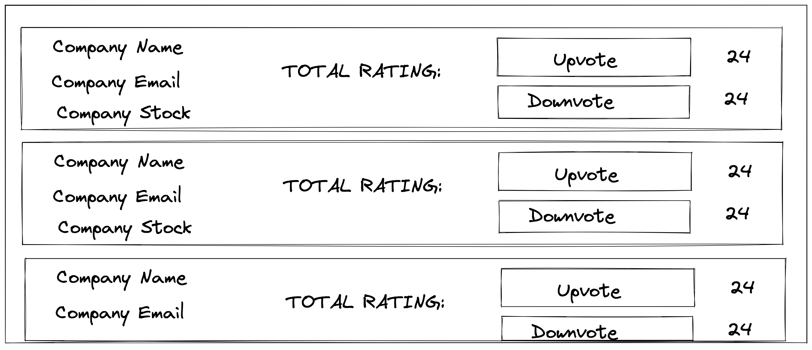

# Props and State

## Learning Objectives

- Pass props to a child component from a parent component
- Access props from inside a react component
- Explain what state is in React and why it is useful
- Change the `state` of a component using `setState()`
- Use the contents of `state` to change what is rendered

## Pre-work

### Read

**Setup:** If it hasn’t been created, create a thread in the #workshops channel titles ‘Props and State: Answers’

Read the Components and Props section of the React Docs:
https://reactjs.org/docs/components-and-props.html

### Watch

Watch the following video on React State and Props: https://www.youtube.com/watch?v=IYvD9oBCuJI

### Write

Answer the following questions, and post your answers at the end of the pre-work time into the #workshop thread.

- What does a prop do?
- What does the state do?
- Where can you access the state from?
- Is the data flow between child and parent components, multidirectional or unidirectional?

## Workshop

### Live Code

Using the mock data included of randomly generated companies (`02_company_data.json`) create a simple application that builds a profile card for each of them.

For each of the profiles, add a “Upvote” and “Downvote” button that lets you rate a company. Show a total “Like” count for how many times the company has been liked and disliked (think of a system similar to YouTube videos)

- `props` should be used to pass information about each of the companies to the ProfileCard component
- `state` should be used to store the like/dislike count for each company

See below for a rough design

Stretch goals for this project could include

- Laying out the app with Flexbox
- Saving the updated files back to the company data `.js` file
- Enhanced CSS for the buttons, titles etc
- Showing the % for upvotes and downvotes
