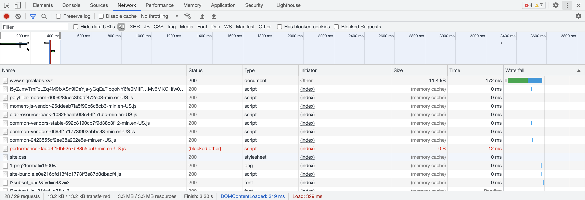

# Frontends III: Networking & APIs <!-- omit in toc -->

## Contents <!-- omit in toc -->

- [Learning Objectives](#learning-objectives)
- [Introducing APIs](#introducing-apis)
  - [Exercise 1: Inspect APIs](#exercise-1-inspect-apis)
  - [Exercise 2: Render Your API](#exercise-2-render-your-api)
- [HTTP Requests & Responses](#http-requests--responses)
  - [Inspect Requests with Chrome Developer Tools](#inspect-requests-with-chrome-developer-tools)
  - [Exercise 1: Crash Course](#exercise-1-crash-course)
  - [Exercise 2: Request](#exercise-2-request)
  - [Exercise 3: Response](#exercise-3-response)
- [Introducing Asynchronous Code](#introducing-asynchronous-code)
  - [Challenge 1: Async/Await](#challenge-1-asyncawait)
    - [Let's make a Promise](#lets-make-a-promise)
    - [Converting to Async/Await](#converting-to-asyncawait)
      - [Exercise 1: Async](#exercise-1-async)
      - [Exercise 2 (Optional)](#exercise-2-optional)
  - [Challenge 2: Country facts app](#challenge-2-country-facts-app)
    - [React Component lifecycle](#react-component-lifecycle)
    - [Loading API Data in React](#loading-api-data-in-react)
    - [`fetch`ing data in React](#fetching-data-in-react)
    - [Tasks](#tasks)
- [`POST`ing Data to an API](#posting-data-to-an-api)
  - [Challenge 3: Micro-Blogging Platform](#challenge-3-micro-blogging-platform)
    - [API](#api)
    - [User Stories](#user-stories)
    - [Getting Started](#getting-started)
    - [Above & Beyond](#above--beyond)
      - [1. Routes](#1-routes)
      - [2. Auto-Refresh](#2-auto-refresh)
      - [3. Design](#3-design)

## Timetable <!-- omit in toc -->

| Time                | Focus                                                                                                                                                                                                                                                                                                                                   |
| ------------------- | --------------------------------------------------------------------------------------------------------------------------------------------------------------------------------------------------------------------------------------------------------------------------------------------------------------------------------------- |
| Monday morning      | Learn about [APIs](#introducing-apis), inspect APIs, render them using the DOM                                                                                                                                                                                                                                                          |
| Monday afternoon    | Learn about [HTTP Requests & Responses](#http-requests--responses), learn how requests and responses work on the internet                                                                                                                                                                                                               |
| Tuesday morning     | Complete [Challenge 1](#challenge-1-asyncawait), write code that run asynchronously, use the async/await keywords                                                                                                                                                                                                                       |
| Tuesday afternoon   | Begin [Challenge 2](#challenge-2-country-facts-app), implement fetching data and displaying to the screen                                                                                                                                                                                                                               |
| Wednesday morning   | Complete [Challenge 2](#challenge-2-country-facts-app), implement additional tasks                                                                                                                                                                                                                                                      |
| Wednesday afternoon | Begin [Challenge 3](#challenge-3-micro-blogging-platform), fetch messages from the server, display to the screen                                                                                                                                                                                                                        |
| Thursday morning    | Complete [Challenge 3](#challenge-3-micro-blogging-platform), post messages to the server, work on UI                                                                                                                                                                                                                                   |
| Thursday afternoon  | Take the [Week 4 Mastery Quiz](./quiz.md).                                                                                                                                                                                                                                                                                              |
| Friday              | **If you scored more 9 or more in the Mastery Quiz** - Congratulations 🎉! You've mastered the concepts for this week. You can move on to the Above & beyond challenges.                                                                                                                                                                |
|                     | **If you scored less than 9 in the Mastery Quiz** - Take the time you need to review the concepts you're unsure about (the guidance in the Quiz answers will point you to the materials to review). Once you're comfortable with all the concepts in the quiz, you can move on to the Above & beyond challenges for any remaining time. |

## Learning Objectives

This week is all about building React apps that speak to other computers over the internet. This is when the code you're writing really get interesting!

By the end of this week you will be able to

- Define what an API is and why it’s useful
- Use `curl` to `GET` data from an API using the command line
- Use `fetch` to retrieve data from an API
- Use `async`/`await` to call asynchronous code
- List and define the key HTTP response codes
- List and define the difference between HTTP methods
- Convert data retrieved by `fetch` into a JSON/JS Object
- Update state depending on the successful `fetch` of data from an API
- Display data fetched from an API in a React component
- Conditionally render a component depending on the current state
- Show an error state depending on the result of a network call
- Use `fetch` to post data to an API

## Introducing APIs

Before we proceed to the week's final challenge, let's take a quick detour and talk about **Application Programming Interfaces** or **APIs**. At a very high level, APIs control how one piece of software talks to other pieces of software. In practice, you can think of API for a website as an alternative version of the site which is designed to be **consumed by a computer program instead of a human**. Let's make this clearer by looking at an example. Load up the profile of any Github user (or take a look at your own profile), for example: https://github.com/addyosmani

Let's take a look at the sidebar. It's nicely designed - but it's definitely designed for humans. For example, the pieces of information aren't explicitly labelled. We can infer from the visual hierarchy that the largest text is probably the user's name. Likewise, we can quickly recognise the envelope icon indicates an email, or spot the Twitter logo. As humans, we can make these inferences easily, but this would be problematic for a machine to parse.

Likewise, lots of effort has gone into making the page aesthetically pleasing - but these efforts are at best irrelevant if we're writing some program to process this data. Some of these "features" might be actively annoying, the way numbers are shortened to a "human friendly" format of "36.6k followers".

It's very useful for Github to allow developers to write programs which leverage the platform's data - but they wouldn't want to compromise the usability of their user facing site. So instead they, like many companies, offer an API - which we can think of as an alternative version of the Github website designed for machines. Let's look at the equivalent of the user sidebar served by the API (https://api.github.com/users/addyosmani):

```json
{
  "login": "addyosmani",
  "id": 110953,
  "node_id": "MDQ6VXNlcjExMDk1Mw==",
  "avatar_url": "https://avatars2.githubusercontent.com/u/110953?v=4",
  "gravatar_id": "",
  "url": "https://api.github.com/users/addyosmani",
  "html_url": "https://github.com/addyosmani",
  "followers_url": "https://api.github.com/users/addyosmani/followers",
  "following_url": "https://api.github.com/users/addyosmani/following{/other_user}",
  "gists_url": "https://api.github.com/users/addyosmani/gists{/gist_id}",
  "starred_url": "https://api.github.com/users/addyosmani/starred{/owner}{/repo}",
  "subscriptions_url": "https://api.github.com/users/addyosmani/subscriptions",
  "organizations_url": "https://api.github.com/users/addyosmani/orgs",
  "repos_url": "https://api.github.com/users/addyosmani/repos",
  "events_url": "https://api.github.com/users/addyosmani/events{/privacy}",
  "received_events_url": "https://api.github.com/users/addyosmani/received_events",
  "type": "User",
  "site_admin": false,
  "name": "Addy Osmani",
  "company": "Google",
  "blog": "https://www.addyosmani.com",
  "location": "Mountain View, California",
  "email": null,
  "hireable": null,
  "bio": "Engineering Manager at Google working on Chrome & Web Platform",
  "twitter_username": "addyosmani",
  "public_repos": 311,
  "public_gists": 176,
  "followers": 36558,
  "following": 257,
  "created_at": "2009-08-01T18:39:25Z",
  "updated_at": "2020-12-02T15:02:14Z"
}
```

All the issues we noted with the website are addressed. All pieces of information are clearly labelled with unique keys, all the "cruft" (styling, icons etc.) is stripped away, and the data is explicitly designed to be read by machines: numbers are fully represented, and timestamps use a format which is human friendly but convenient to parse for programs.

Before you move onto the third challenge, make sure you're comfortable with the concepts relating to APIs by reviewing the materials below:


- [:link: - REST API concepts and examples](https://www.youtube.com/watch?v=7YcW25PHnAA) (10 min watch)
- [:link: - What is an API? In English, please.](https://www.freecodecamp.org/news/what-is-an-api-in-english-please-b880a3214a82/) (5 min read)

### Exercise 1: Inspect APIs

There are a huge amount of open, free APIs that we can tap into that do everything from interrogate a nations health data to fetch images of cats. Check them out

https://github.com/public-apis/public-apis

You can experiment with API by using the `curl` command in iTerm. You can read the instructions for this [here](https://www.booleanworld.com/curl-command-tutorial-examples/).

For this task, you should choose an API and use `curl` to retrieve data from them.

Mostly, you'll want to use this command to retrieve data from an API.

```sh
curl -X GET "URL_OF_API"
```

**Note**: Only choose APIs that have `no` in the `Auth` column. This will speed up the amount of time it takes to get started.

When exploring the APIs it can be good to keep in mind the different parts of a URL. You can see a breakdown of all of the different parts of a URL here:


You should find API endpoint that uses

1. Path Parameters
   - e.g. api.com/path/to/api
2. Query Parameters
   - e.g. api.com/cool?coolness=99

Spend some time experimenting with different endpoints until you feel comfortable.

### Exercise 2: Render Your API

_Note:_ For this exercise, work in pairs using strict pair programming technqiues. Driver and navigator, switch ever 10 minutes.

For the next task, choose one of the APIs that you found interesting and render the data to the browser by using DOM Manipulation like you did in Week 3. i.e. using `document.createElement()`, `document.appendChild()` ...

Some ideas might be

- If your API returns image urls, render them to the browser
- If your API returns lists of data, render them as `ul` and `li` in the browser
- If your API has sections, separate them into separate `div`s as you find suitable
- If your API delivers random content, add a refresh button

If you complete these tasks, add multiple `fetch` calls that fetch different endpoints.

You can find two files to get your started. You should commit all of your code here.

- `apis/api_task.html`
- `apis/api_task.js`

## HTTP Requests & Responses

> **We've taught this before!**
>
> See a previous version of this class [here](https://sigmalabs.rewatch.com/video/10171/working-with-apis-in-react-coding-workshop-june-16-2021/) from 00:00 to 17:00

Everything on the internet is coordinated by a series of requests and responses between different computers. Imagine the following scenario where I am searching on Google.

In this example, **\>\>\>** denotes a request to Google's server and **<<<** denotes a response.

> **\>\>\>** I navigate to Google.com and I request the HTML for the page
>
> **<<<** Google sends me the HTML for the webpage
>
> **\>\>\>** I read the HTML and find that I need three items to render the page. 1. A CSS file, 2. The Google Logo and 3. A JavaScript file
>
> **\>\>\>** I request the CSS file from Google's servers
>
> **<<<** I receive the CSS file and apply styling to the HTML file
>
> **\>\>\>** I request the 'Google' Logo from Google's servers
>
> **<<<** I receive the logo and display it om the screen
>
> **\>\>\>** I request the JavaScript file
>
> **<<<** I receive the Javascript file and run the code inside

Great! I've now loaded all of the data I need to from Google's servers.

Next take a look at what happens when I want to search for a topic I care about.

> **\>\>\>** I type in my search term and click search. This send a request to a Google API that will find my results.
>
> **<<<** After some time, Google's API will respond with my results.

Great! I've got my search results.

All of these requests and responses can be broken down into three separate parts

1. URL and Path
   - This contains where we're requesting the data from (e.g. Google.com)
2. Headers
   - This configures how data is retrieved (e.g. in what format, how long data should be kept for)
3. The Body
   - This contains any information that we request (e.g. a CSS file, an image or a JavaScript file)

### Inspect Requests with Chrome Developer Tools

You can see each of these exchanges if you look at the [`Developer Tools`](https://developer.chrome.com/docs/devtools/) in Chrome. To view them:

1. Press Option+Command+I to open the tools window
2. Then click on the network tab.
3. Refresh the webpage

You should see a menu that looks like this



Clicking on each of the lines in the result will reveal all of the request headers and responses for each of the requests.

When you're inspecting each of these request and responses you'll begin to see common attributes come out of each one, for example

- HTTP Request Method
- Response Code
- Response Headers

In the next few exercises we'll be exploring what these different parameters do.

### Exercise 1: Crash Course

This video from Traversy Media gives a fantastic overview of the this topic. Watch it now.

> [ " height="200">](https://www.youtube.com/watch?v=iYM2zFP3Zn0)
>
> [:link: - HTTP Crash Course & Exploration](https://www.youtube.com/watch?v=iYM2zFP3Zn0)

### Exercise 2: Request

_Note:_ For this exercise, work in pairs or small groups.

Take a look at this example `GET` request

```
GET /howtobeagreatstudent.html HTTP/1.1
Host: sigmalabs.xyz
User-Agent: Mozilla/5.0 (Windows; U; Windows NT 6.1; en-US; rv:1.9.1.5) Gecko/20091102 Firefox/3.5.5 (.NET CLR 3.5.30729)
Accept: text/html,application/xhtml+xml,application/xml;q=0.9,*/*;q=0.8
Accept-Language: en-us,en;q=0.5
Accept-Encoding: gzip,deflate
Accept-Charset: ISO-8859-1,utf-8;q=0.7,*;q=0.7
Keep-Alive: 300
Connection: keep-alive
Cookie: PHPSESSID=r2t5uvjq435r4q7ib3vtdjq120
Pragma: no-cache
Cache-Control: no-cache
```

Research online to find what each of the above fields (i.e. the part to the left of each `:`) means and what it does.

The deliverable for this piece of work is a report in the file names `http_report.md` in this folder.

When completed each of the titles in the report should include:

- A brief description of what the field does
- An example of when the field is used
- A selection of values or content that the field can hold
- Any unanswered questions you've got about the field
- Any other notes you found about the field.

### Exercise 3: Response

Here is an example `response` for the `request` above

```
HTTP/1.x 200 OK
Date: Sat, 28 Nov 2009 04:36:25 GMT
Server: LiteSpeed
Connection: close
X-Powered-By: W3 Total Cache/0.8
Pragma: public
Expires: Sat, 28 Nov 2009 05:36:25 GMT
Etag: "pub1259380237;gz"
Cache-Control: max-age=3600, public
Content-Type: text/html; charset=UTF-8
Last-Modified: Sat, 28 Nov 2009 03:50:37 GMT
Content-Encoding: gzip
Vary: Accept-Encoding, Cookie, User-Agent

<!DOCTYPE html PUBLIC "-//W3C//DTD XHTML 1.0 Strict//EN" "https://www.w3.org/TR/xhtml1/DTD/xhtml1-strict.dtd">
<html xmlns="http://www.w3.org/1999/xhtml">
<head>
<meta http-equiv="Content-Type" content="text/html; charset=utf-8" />
<title>Want to be a great student at Sigma? Here's how!</title>
...
...
...
</head>
</html>
```

Again, spend some time decoding what each of the fields does.

As before, complete the sections in the `http_report.md` file with your findings.

## Introducing Asynchronous Code

> **We've taught this before!**
>
> See a previous version of this class [here](https://sigmalabs.rewatch.com/video/10171/working-with-apis-in-react-coding-workshop-june-16-2021/?t=1024) from 17:00 onwards

When we're writing code, sometime different tasks might take some time time to happen. For example,

- Loading a long video from our laptop
- Download a big file from the internet
- Waiting for a user to do something

In the real world we might look at different types of communication being asynchronous or syncronous. For example,

- A **phone call** could be regarded as **synchronous** as both people have to present and active at a single time.
- An **email** is **asynchronous** as one person can act and then - at any point in the future - the other person can respond without the first person waiting for them.

This can be displayed in this diagram

> 
>
> _Credit to Sunil Singh in [this article](http://blogs.quovantis.com/asynchronous-programming-async-and-await-in-c/)_

### Challenge 1: Async/Await

Introducing Async/Await - you've met before!

If you look back to Week 1 of this course you'll see that we used async/await to wait for the user to input their Blackjack choice. However, up until this point you'll have used them but - maybe - not quite understood whats going on in the background.

To understand them, first you need to know a little about Promises

#### Let's make a Promise

A Promise is a special type of JavaScript object that can exist in three different state.

1. Pending
2. Resolved
3. Rejected

This Scrimba lesson has a good set example of how Promises work in action

https://scrimba.com/scrim/c4GDqRA8

When you've watched the lesson, we'll expand here about async/await can help you write simpler code

#### Converting to Async/Await

In the above example we wrote a function that flips a coin. It looks like this

```js
function flipCoin() {
  return new Promise((resolve, reject) => {
    const randomNum = Math.floor(Math.random() * 2)

    if (randomNum === 0) {
      resolve('HEADS')
    } else if (randomNum === 1) {
      reject('TAILS')
    }
  })
}

flipCoin()
  .then((response) => console.log('RESOLVED: ' + response))
  .catch((error) => console.log('REJECTED: ' + error))
```

The way that `async` and `await` work is that by telling JavaScript that a function will take a while to execute it will force it to return a promise.

```js
async function flipCoin() {
  return new Promise((resolve, reject) => {
    ...
  })
}
```

By adding the `async` keyword to the front of the function we force the function to always return a Promise. This means we can go one step further and return our promise completely.

```js
async function flipCoin() {
  const randomNum = Math.floor(Math.random() * 2)

  if (randomNum === 0) {
    return 'HEADS'
  } else {
    throw 'TAILS'
  }
}
```

We can then use the `await` keyword to resolve the Promise into a variable, avoiding the need to use a `.then()`

```js
const result = await flipCoin()
console.log(result)
```

This will now work, except because we don't implement a `.catch()` the program will crash 50% of the time when we `throw 'TAILS'`. To fix this we'll have to write our code in a `try/catch` block.

```js
try {
  const result = await flipCoin()
  console.log(result)
} catch (e) {
  console.log(e)
}
```

##### Exercise 1: Async

Complete the exercises in

`async/async_exercises.js`

##### Exercise 2 (Optional)

Still not quite understanding how async/await works?

Watch [this](https://scrimba.com/playlist/p9wbxhk) Scrimba lesson.

### Challenge 2: Country facts app

2020 was undoubtedly the year of virtual pub quizzes 🍻. Capital cities, country flags etc. are a consistently popular trove of trivia questions. If you've ever found yourself with a country's capital on the tip of your tongue, or trying to remember the colors of the flag on some far-flung nation our last project is for you: an app which will display basic info about a host of countries. More importantly, this will give us our first experience of working with a 3rd party API: [REST Countries](https://restcountries.eu/).


The goal of this challenge is to implement an application similar to the screenshot above, with the following functionality:

- The sidebar should show a list of countries (you can hard code the list for now)
- Click on a country should highlight it in the sidebar, and switch the main view
- The main view should display:
  - The country name
  - The country flag (an `` tag)
  - The population
  - The capital city

You should be able to implement most of this functionality yourself using what we learnt in the previous challenge. However, one twist is that for this application we'll load the data through an API. We'll examine this part of the challenge together.

#### React Component lifecycle


The diagram above (you can also find an interactive version [here](https://projects.wojtekmaj.pl/react-lifecycle-methods-diagram/)) shows that React components go through 3 different stage. Broadly:

- Mounting occurs when a component is inserted into the DOM
- Updating occurs when a component's props or state changes
- Unmounting occurs when a component is removed from the DOM

In our case, we want the data to load right away (on page load), so we'll target the mounting phase. Each stage is split in two phases, a render phase and a commit phase. We use the commit phase when we want to trigger side effects. What's a side effect? Per the React docs:

> Data fetching, setting up a subscription \[(an event listener)\], and manually changing the DOM in React components are all examples of side effects. Whether or not you’re used to calling these operations “side effects” (or just “effects”), you’ve likely performed them in your components before.

We're interested in fetching data, which is indeed a side effect. Looking at the diagram, we'll want the `component­Did­Mount()` method.

Sometimes, if we do something in the `component­Did­Mount()` method, we might want to _undo_ it in the `component­WillUnmount()`. For example, if we add an event listener on mount, we should remove it on unmount. In this case, we can't "unfetch" data, so we won't need any unmount behavior.

#### Loading API Data in React

Let's create a simple country display component:

```jsx
class CountryDisplay extends Component {
  state = {
    countryData: null
  }

  render() {
    const { countryData } = this.state

    if (!countryData) return <div>Loading...</div>
    return <div>{JSON.stringify(countryData)}</div>
  }
}
```

Hopefully, the behavior of this component is fairly clear: if `state.countryData` is present, it's output inside a `<div>` (with a no-frills display courtesy of [`JSON.stringify`](https://developer.mozilla.org/en-US/docs/Web/JavaScript/Reference/Global_Objects/JSON/stringify)). If not, the text `Loading...` is output instead. Since `countryData` is initially `null`, the latter is what will be displayed initially.

How then should we populate `state.countryData`? Previously, we've set state in response to user actions (clicking something, submitting a form etc.). This time, as soon as the component is rendered for the first time, we'll load some data from the [REST Countries API](https://restcountries.eu/), specifically, we'll use the URL:

https://restcountries.eu/rest/v2/alpha/es?fields=name;capital;population;flag

which will give us some data about Spain (you can click through to view the JSON API response in your browser). To leverage the data coming back from this URL, named an **API endpoint**, we'll need learn about two new concepts: the React component lifecycle, and the `fetch` method.

#### `fetch`ing data in React

Now we know where our data fetching code needs to go (in our component's `component­Did­Mount()` method), let's implement it:

```jsx
class CountryDisplay extends Component {
  state = {
    countryData: null
  }

  async componentDidMount() {
    const apiResponse = await fetch(
      'https://restcountries.eu/rest/v2/alpha/es?fields=name;capital;population;flag'
    )
    const countryData = await apiResponse.json()

    this.setState({ countryData })
  }

  render() {
    const { countryData } = this.state

    if (!countryData) return <div>Loading...</div>
    return <div>{JSON.stringify(countryData)}</div>
  }
}
```

Here we're encountering the [`fetch`](https://javascript.info/fetch) method, which allows us to make calls fetch data from our API "in the background" (e.g. without physically navigating to the URL in our browser). Note that because we're using the `await` keyword, we need to mark the `componentDidMount()` function as `async`.

You should now have the elements you need to complete the country facts app!

#### Tasks

Once you've completed the basic country facts app, you should extend it in any way you want. Some suggestions:

1. When fetching data from an external API, there's always a chance something could go wrong! (For example, the API might suffer temporary downtime). Add error handling to your `componentDidMount()` method.
   - You can simulate the API being unreachable by simply disabling your WiFi temporarily.
2. Right now we're hardcoding the list of countries. Try dynamically fetching all countries (and their country codes) from this endpoint: https://restcountries.eu/rest/v2/all?fields=name;alpha2Code
3. If you do add all those countries, the sidebar becomes a bit unwieldy. Add a text box at the top of the sidebar which allows you to filter down the list of countries. (You can use any matching algorithm you like).
4. Add any additional details you like that the REST Countries API offers.
5. Use the GDP data [here](https://pkgstore.datahub.io/90998f7f90e086bd5fc7c9075dfda43b/gdp/1/gdp_json/data/f11cb8c477556e91ca01e19619af0beb/gdp_json.json) to add a GDP field to your fact app (you'll need to make two API requests now).
6. Use the [Geolocation API](https://developer.mozilla.org/en-US/docs/Web/API/Geolocation_API) to automatically default to the country the user is visiting from.

## `POST`ing Data to an API

Up until this point, we've only ever been `GET`ting data from an API. However, what makes the modern web really useful is the ability to be able to send - or `POST` - information to a web service to interact with it.

You can achieve this by using `fetch` with some specific headers and a body.

Consult the [Fetch API docs](https://developer.mozilla.org/en-US/docs/Web/API/Fetch_API/Using_Fetch) for information on how to achieve this.

Take a look at this example code that uses `fetch` to post data to a server:

```js
const data = { username: 'example' }

let response = await fetch('https://example.com/profile', {
  method: 'POST',
  headers: {
    'Content-Type': 'application/json'
  },
  body: JSON.stringify(data)
})

console.log(response)
```

In this example we are

1. Constructing a data object to send
2. Writing a `fetch` request
3. Setting the method to `POST`
4. Informing the server to expect json by setting the `Content-Type` header
5. Setting the `body` to the json object converted to a string
6. Storing the response in the `response` variable
7. Finally, printing the response to the console

### Challenge 3: Micro-Blogging Platform

For this challenge, we're going to build a Micro-Blogging Platform similar to Twitter or Tumblr.

#### API

You can find the code for an API here:

https://github.com/Sigma-Labs-XYZ/micro-blogging-server

We've setup the API for you and you can find it here:

https://sigma-micro-blogging.herokuapp.com/

A users profile is defined from the path url. For example, to get the profile of the user `SigmaStudent99` you would fetch data from the API endpoint

https://sigma-micro-blogging.herokuapp.com/SigmaStudent99

For more details, view the [README](https://github.com/Sigma-Labs-XYZ/micro-blogging-server#readme) in the API repository.

#### User Stories

[User Stories](https://www.mountaingoatsoftware.com/agile/user-stories) are a common way of extracting all of the details of a project before you start working on it. They will always take the form "As a **X** I want to be able to **Y** so that I can **Z**" where X is is the user role and Y is what they want to be able to achieve and Z is why they want to achieve it.

As a user...

- I want to view all of the microblogs that have been posted to the service at once so I can see an overview of all microblogs on the platform
- I want to set my username for the service to other users know who has posted microblogs
- I want to view all of my past microblogs posts so I can review all the microblogs I've ever posted
- I want to post a microblog to my profile so I can share my thoughts on a topic
- I want to edit my microblogs after I have posted them so I can change my mind or fix a typo
  - I should **not** be able edit another user's microblogs
- I want to see the time that each microblog was posted so I know how relevant the microblog is
- I want to see the name of the user that posted a microblog
- I want to navigate to another user's profiles by entering their username in a text input field so that I can view other microblogs
  - If no user is found, show an error message
- I want to view another user's microblogs on their profiles so I can get their thoughts on a topic

As a developer...

- I want to be able to test that my app is working properly by running meaningful tests so I have confidence in the product I am building

#### Getting Started

You can find a basic React app in the `microblog` folder.

Don't forget to install the app using `npm install` before trying to run.

#### Above & Beyond

##### 1. Routes

Instead of using a search box to set the user's profile, use the path parameters of the url to decide which users profile to view. For example, to visit the profile of `SigmaStudent99` you would navigate to the path `localhost:8080/SigmaStudent99`.

You should research [React Router](https://reactrouter.com/) to help you achieve this.

Written as a user story, this could be written as

> As a user, I want to be able to navigate to a users profile by navigating to a path in my browser.

##### 2. Auto-Refresh

If I spend some time on a user's profile, the data I am seeing may become out of date.

You should add a feature that will automatically re-fetch the data from the API every 30 seconds. Also, add a button that will re-fetch the data from from the API.

Written as a user story, this could be written as

> As a user, I want to profiles to be refreshed every 30 seconds to see the latest microblogs
>
> As a user, I want to be able to click a button and for the microblogs to be refreshed.

##### 3. Design

Spend some time thinking about the design of your Micro-Blogging Platform. For example, take the [GOV UK](https://twitter.com/GOVUK) Twitter account:

- What elements do they use that your implementation is missing?
- How are different elements spaced?
- What fonts and font sizes do they use?
- How are different elements aligned?

Consider using a UI Framework such as [Bootstrap](https://getbootstrap.com/) to help give your UI a boost.
