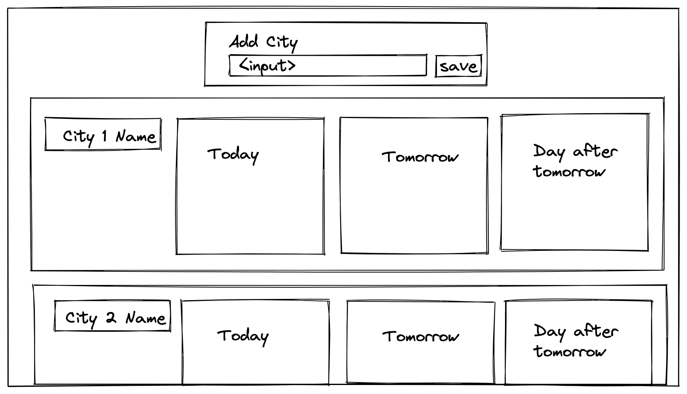

# React Techniques

## Learning Objectives

- Conditionally render a component depending on the current state
- Show an error state depending on the result of a network call
- Pass data from a child component to a parent component using a callback

## Pre Work

### Questions

This is going to be our last workshop dedicated to React and so we're going to show you a few classic issues that beginners face.

We'll also have time for questions so please

1. Create a thread of Slack titled `React Questions`
2. Post any final questions or topics you'd like to cover again in the thread.

Apart from this, you are welcome to continue with your coursework until the workshop starts.

## Workshop

### Pop Quiz

1. List at least four benefits of using React
2. What is a promise?
3. Convert this `promise` into an `await`

```js
fetch('http://example.com/movies.json')
  .then((response) => response.json())
  .then((data) => this.setState(data))
```

4. Split this URL into each of it's component parts and give them their correct name

```txt
http://www.example.com:80/docs/index.html?loggedin=true#heading
```

5. When would you use a `GET` request? When would you use a `POST` request?
6. What does the response code 200 mean?
7. What does the response code 404 mean?

### Q+A

Run through any questions that the students have generated from the pre-work

### Live Code

For this workshop, we're going to Live Code a tiny weather app in React using this API Endpoint

https://goweather.herokuapp.com/weather/London

Here is a rough wireframe of what we're looking to make



The most important points to teach here are to

1. Have an empty state when there have been no cities added
2. Have an error state if the `fetch()` calls fail (e.g. no wifi)
3. Show how to pass data from a child component using a callback function passed as a prop (from the `Add City` component to the `App` component)
