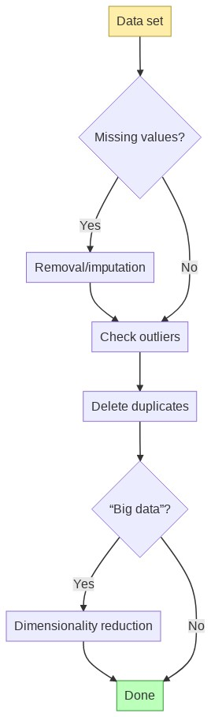

# Data Science I: Fundamentals <!-- omit in toc -->

## Contents <!-- omit in toc -->

- [Learning Objectives](#learning-objectives)
- [Previous Sessions](#previous-sessions)
- [Intro to Data Science](#intro-to-data-science)
  - [Descriptive questions](#descriptive-questions)
  - [Diagnostic questions](#diagnostic-questions)
  - [Predictive questions](#predictive-questions)
  - [Prescriptive questions](#prescriptive-questions)
- [Intro to Python](#intro-to-python)
  - [Installing Python](#installing-python)
- [Project 1: NY Covid park data](#project-1-ny-covid-park-data)
  - [Challenge 1a: Obtaining the data](#challenge-1a-obtaining-the-data)
  - [Challenge 1b: Scrubbing the data](#challenge-1b-scrubbing-the-data)
    - [Working with dataframes](#working-with-dataframes)
    - [Data cleaning process](#data-cleaning-process)
    - [Missing values](#missing-values)
    - [Check outliers/anomalies](#check-outliersanomalies)
    - [Delete duplicates](#delete-duplicates)
    - ["Big data"?](#big-data)
    - [Wrapping Up](#wrapping-up)
  - [Challenge 2a: Largest Crowds](#challenge-2a-largest-crowds)
    - [Getting Setup](#getting-setup)
    - [Exercise](#exercise)
    - [Solution](#solution)
  - [Challenge 2b: Size of Crowd and Action](#challenge-2b-size-of-crowd-and-action)
    - [Getting Setup](#getting-setup-1)
    - [Exercise](#exercise-1)
- [Challenge 3: Fly Tipping Report](#challenge-3-fly-tipping-report)
  - [Getting Setup](#getting-setup-2)
  - [Exporting your Report](#exporting-your-report)
  - [Questions](#questions)
    - [Simpler Questions](#simpler-questions)
    - [Complex Questions](#complex-questions)

## Timetable <!-- omit in toc -->

| Time                | Focus                                                                                                                                                                                                                                                                                                                              |
| ------------------- | ---------------------------------------------------------------------------------------------------------------------------------------------------------------------------------------------------------------------------------------------------------------------------------------------------------------------------------- |
| Monday morning      | Learn about what data science is, install Python, work through introductory Python material.                                                                                                                                                                                                                                       |
| Monday afternoon    | Complete [Challenge 1a](#challenge-1a-obtaining-the-data), install pandas, load Covid data set                                                                                                                                                                                                                                     |
| Tuesday morning     | Complete [Challenge 1b](#challenge-1b-scrubbing-the-data), scrubbing the data set                                                                                                                                                                                                                                                  |
| Tuesday afternoon   | Complete [Challenge 2a](#challenge-2a-where-do-the-largest-crowds-tend-to-gather), find out where the largest crowds tend to gather                                                                                                                                                                                                |
| Wednesday morning   | Complete [Challenge 2b](#challenge-2b-is-there-a-relationship-between-the-size-of-a-crowd-and-the-action-taken-by-the-park-service), perform logistic regression, investigate relationship between crowd size and action                                                                                                           |
| Wednesday afternoon | Start [Challenge 3](#challenge-3-fly-tipping), open ended analysis of fly tipping data                                                                                                                                                                                                                                             |
| Thursday morning    | Finish Challenge 3.                                                                                                                                                                                                                                                                                                                |
| Thursday afternoon  | Take the [Week 6 Mastery Quiz](./quiz.md).                                                                                                                                                                                                                                                                                         |
| Friday              | **If you scored more 9 or more in the Mastery Quiz** - Congratulations 🎉! You've mastered the concepts for this week. You can move on to trying to answer the _"Harder questions"_ for Challenge 3.                                                                                                                               |
|                     | **If you scored less than 9 in the Mastery Quiz** - Take the time you need to review the concepts you're unsure about (the guidance in the Quiz answers will point you to the materials to review). Once you're comfortable with all the concepts in the quiz, you can move on to the _"Harder questions"_ for any remaining time. |

## Learning Objectives

By the end of this week a learner will be able to

- Display a core competency of Python. They should be able to
  - Write a function declaration using parameters
  - Call a function with parameters
  - Return variables from a function and store into a variable
  - Implement an if/else statement
  - Retrieve elements from an array
  - Write elements to an array
  - Access variables in an object
  - Store variables to object
  - …
- Compare JavaScript and Python as programming languages
- Convert a JavaScript program into Python
- Load a dataset into a Python variable using Pandas
- Extract metadata about datasets using Pandas.
- Clean a dataset using Pandas
- Calculate common mathematical results using Pandas including the total, mean and median.
- Recall and explain the stages of the data science process (the OSEMN framework)
- Generate a table from a dataset using matplotlib
- Identify better or worse statistical results based on their p-value

By the end of this week a learner might be able to

- Calculate a regression analysis of a dataset
- Configure Juypiter notebook to display their results

## Previous Sessions

You can find the previous recorded sessions of this week here on Rewatch

- [Cohort 1 Workshops](https://sigmalabs.rewatch.com/collection/786/week-5-intro-to-data-science)

## Intro to Data Science

This week we'll learn the basics of data science. At a high level, data science is about using data (usually stored electronically) to answer questions - Cassie Kozyrkov sums it up as "Data science is the discipline of making data useful". Data scientists routinely tackle a broad range of questions, which we usually segment into four buckets: descriptive, diagnostic, predictive and prescriptive:


### Descriptive questions

Descriptive questions look at data statistically to tell you what happened in the past. It's generally the simplest form of data science, and what we'll primarily look at this week. Some descriptive questions that top tech companies might ask include:

- How many miles in total did Uber drivers drive last year?
- How many minutes of Netflix does an average subscriber watch in a week?
- On YouTube, which channel has the most subscribers from Ireland?

### Diagnostic questions

Diagnostic questions look at the factors behind why something happened. It's also sometimes called root cause analysis. It's hard to answer with complete certainty why something happened (you might have stopped paying your Netflix subscription because you were eaten by an alligator, but no statistical model will capture that!) so diagnostic questions tend to be answered in terms of probabilities and likelihoods. Some examples of diagnostic questions include:

- Why did Netflix see a spike of people unsubscribing at the beginning of the year?
- Why do Uber drivers in London have a lower average rating than drivers in New York?

### Predictive questions

Predictive questions are about predicting future outcomes. No one can predict the future perfectly of course, but by analysing historical patterns and trends data scientists attempt to model the future as accurately as possible. Today, data scientists often leverage [machine learning](https://en.wikipedia.org/wiki/Machine_learning) (ML) to better answer predictive questions

- How many units of the iPhone 12 will Apple sell in 2022?
- How many miles in total will Uber drivers drive next year?
- Is a new account which signed up for eBay a genuine or fraudulent account? (This is a predictive question in disguise: we're really trying to predict the likelihood of future fraudulent behaviour).

### Prescriptive questions

Prescriptive questions are predictive questions taken to the next level. They ask not just what will happen, but what should we do in the future? Again, in a modern context answering these questions often draws heavily on recent machine learning research.

- Which TV series should we suggest to a customer who enjoyed Stranger Things?
- How long should a YouTube advert be to optimally balance revenue and churn (customers leaving the platform)?
- What colors options should Apple offer for the iPhone 12?

<hr>

Since we're just starting out, this week we'll focus primarily on descriptive questions. We'll take existing (historical) data sets, and look for patterns, interesting data points and useful insights. Before moving on to the next section, watch the video below:


- [:link: - Intro to Data Science: What is Data Science?](https://www.youtube.com/watch?v=FsSrzmRawUg) (10 min watch)

<br>
<hr>
<br>

## Intro to Python

Until this point in the course we've used JavaScript exclusively, but this week we're going to use Python. Although it's still possible to do basic data science in JS, Python is the most popular language (at the time of writing) for serious data science. It has an excellent range of libraries which cover fundamental data science approaches, some of which we'll encounter this week. On top of this, modern data science is closely tied to machine learning - and the current ML ecosystem is almost entirely Python based. The largest ML frameworks - Tensorflow, PyTorch, Keras, Theano - are all written in Python. For more context, take a watch of the video below:


- [:link: - What is Python? Why Python is So Popular?](https://www.youtube.com/watch?v=Y8Tko2YC5hA) (5 min watch)

### Installing Python

If you're on macOS Catalina or later, you already have Python 3.7 installed. This is sufficient for working through the materials this week, although it's recommended to install the latest version of Python by running:

```sh
brew install python
```

Open a new Terminal and run `python3`. You should see an interface like this:


This is Python's [REPL](https://en.wikipedia.org/wiki/Read%E2%80%93eval%E2%80%93print_loop). It's very similar to the Console in DevTools: we can enter any expression here, and get the answer back immediately:


To familiarize yourself with Python, work through the following short tutorial:

- [:link: - Learn X in Y minutes, Where X=Python](https://learnxinyminutes.com/docs/python/) (~60 min exercise)

Copy and paste the examples into your REPL to more easily see what's going on - and feel free to experiment! Change values and variables and see if the output matches what you expect. You should notice that although the syntax of Python is slightly different to what we're used to with JavaScript, most of the underlying concepts are very similar.

<br>
<hr>
<br>

## Project 1: NY Covid park data

Let's start our first data science project 🧪! To start off, we'll analyse an recently released data set, which logs encounters between the NYC Parks department and crowds of people violating social distancing guidelines:

https://data.cityofnewyork.us/dataset/Social-Distancing-Parks-Crowds-Data/gyrw-gvqc

The data set logs when and where the encounter happened, the number of people involved and what action was taken. Since data science is "the discipline of making data useful", we'll try to answer some useful questions:

1. Where do the largest crowds tend to gather?
2. Is there a relationship between the size of a crowd and the action taken by the park service?
3. Are incidences increasing or decreasing over time? Are crowd sizes increasing or decreasing over time?

We've already encountered one way of dividing up the work of a data scientist: the descriptive/diagnostic/predictive/prescriptive framework. To create a plan of attack, let's look at another - the OSEMN framework:


If we were answering predictive or prescriptive questions, we'd need to go through all 5 stages. Since we're only answering descriptive questions this week, we're only really concerned with the first 3 stages:

- **Obtain:** Gathering the relevant data. In this case, this is nice and easy, as the NYC Parks service provides the data readily downloadable in most common formats.
- **Scrub:** Filtering out or replacing bad values, transforming the data so it's "clean" and easy to work with.
- **Explore:** Looking at trends or patterns in the data, and using the data to answer descriptive or diagnostic questions.

Since, as good data scientists, we want our work to be easily repeatable, we'll package our analysis into a single script/program which will obtain, scrub and explore our data. We'll begin by working through the **obtain** and **scrub** steps, and then answer the 3 questions above when we **explore**.

### Challenge 1a: Obtaining the data

It's straightforward enough to manually obtain the data we need, by choosing Export -> CSV on the NYC data site:


(Note: CSV is the easiest format to use for our purposes, because it's very simple and integrates well with the Python libraries we'll be using).

Although the manual approach is fine, downloading the data programmatically will make it easier for other data scientists to easily reproduce our research. Let's write a simple script to download the relevant data. First, we note the URL of the CSV data is: `https://data.cityofnewyork.us/api/views/gyrw-gvqc/rows.csv?accessType=DOWNLOAD`. Next, let's create a new Python file `covid-crowds.py` and import the [`urllib.request` library](https://docs.python.org/3/library/urllib.request.html) (a built in library for handing HTTP requests/downloads):

```python
import urllib.request
```

We can download the CSV file using the [`urlretrieve()` method](https://docs.python.org/3/library/urllib.request.html#urllib.request.urlretrieve):

```python
import urllib.request

urllib.request.urlretrieve('https://data.cityofnewyork.us/api/views/gyrw-gvqc/rows.csv?accessType=DOWNLOAD', 'crowds.csv')
```

Try running the script with `python3 covid-crowds.py` and you should see a `crowds.csv` file containing the relevant data appear in the same directory. Next, let's make our script a bit smarter: currently it will always download a fresh copy of the CSV data even if it's already been downloaded. Instead, let's check to see if `crowds.csv` exists: if it does, the script should continue, and if it doesn't, only then should it be downloaded.

```python
import urllib.request

def crowds_data_is_downloaded():
  filename = 'crowds.csv'
  return False

if not crowds_data_is_downloaded():
  urllib.request.urlretrieve('https://data.cityofnewyork.us/api/views/gyrw-gvqc/rows.csv?accessType=DOWNLOAD', 'crowds.csv')
```

Fill out the `crowds_data_is_downloaded` method so that it checks whether `crowds.csv` file exists in the current working directory.

The next section assumes that you have some basic familiarity with the most common statistical measures: mean/mode/median and range/standard deviation. If you need a refresher, have a watch of the video below:


- [:link: - Intro to Data Science: What is Data Science?](https://www.youtube.com/watch?v=mk8tOD0t8M0) (8 min watch)

### Challenge 1b: Scrubbing the data

There's a saying among data scientists: ["garbage in, garbage out"](https://en.wikipedia.org/wiki/Garbage_in,_garbage_out). If we don't ensure our input data isn't well-formatted, properly parsed and free of errors our analysis will be flawed.

The data provided by the NYC OpenData platform is relatively clean, so it won't need to undergo an intensive data scrubbing step, but it can still benefit from some cleaning. Let's load our data into Pandas, the library we'll be using for our data analysis, and see explore whether there's any erroneous data to scrub away.

First we'll need to install Pandas, by running:

```sh
python3 -m pip install pandas
```

Let's load an interactive Python session (REPL) by running:

```sh
python3
```

In the Python session, let's import Pandas and load our CSV data into Pandas:

```python
import pandas

df = pandas.read_csv('parks.csv')
```

`df` here stands for dataframe, which is the typical way of working with data in Pandas. A dataframe has rows and columns. Each column represents a **feature** of our data, for example: the timestamp of the encounter, the location and action taken are each individual columns. Each row represents an **instance**, a single observation in our data set. In this example, a row represents a single encounter between the parks service and a crowd. We can see the overall shape of our data by writing `print(df)` or simply `df`:

```python
import pandas

df = pandas.read_csv('parks.csv')
print(df)
```

You should see something like this:


#### Working with dataframes

Pandas is extremely sophisticated software with a wealth of features. Before we begin the data scrubbing process, let's look at some of simple operations we can do with data frames.

First, we can get an overview of the our data by calling `df.info()` which lists the columns, their associated data type, number of rows, and also shows us whether columns have any missing (null values):

```python
>>> df.info()
```

```
<class 'pandas.core.frame.DataFrame'>
RangeIndex: 1862 entries, 0 to 1861
Data columns (total 8 columns):
encounter_timestamp    1862 non-null object
park_area_id           1862 non-null object
park_district          1862 non-null object
park_borough           1862 non-null object
patroncount            1862 non-null int64
in_playground          1862 non-null bool
action_taken           1862 non-null object
amenity                1175 non-null object
dtypes: bool(1), int64(1), object(6)
memory usage: 103.7+ KB
```

We can see that amenity has 687 (1862 - 1175) missing/null values, while all the other columns are complete. You can also see that Pandas can make reasonable inferences about the data types of our columns (even though CSV files have no concept of data type): it knows that we should treat `patroncount` as an integer and `in_playground` as a boolean, for example.

Next, we might want to select a subset of our data frame. To grab the top 5 or bottom 5 rows, we can use the `.head()` and `.tail()` methods:

```python
>>> df.head()
```

```
      encounter_timestamp park_area_id                 ...                                                     action_taken                             amenity
0  07/07/2020 02:33:23 PM         X179                 ...                  Approached the crowd; they ignored the employee                    Basketball court
1  07/05/2020 10:40:24 AM         B247                 ...                  Approached the crowd; they ignored the employee                      Baseball field
2  07/04/2020 12:56:31 PM         B247                 ...                  Approached the crowd; they ignored the employee                  Bench/sitting area
3  07/03/2020 10:16:52 PM         Q377                 ...                    Did not approach the crowd; the crowd remains                        Soccer field
4  07/02/2020 03:11:30 PM         B018                 ...                  Approached the crowd; they ignored the employee  Open field/multi-purpose play area

[5 rows x 8 columns]
```

These methods are analogous to the `head` and `tail` Unix activities. You can also pass an integer to `head()` or `tail()` to fetch a different number of rows:

```python
>>> df.tail(10)
```

```
         encounter_timestamp park_area_id                 ...                                                     action_taken                             amenity
1852  07/14/2020 10:00:38 AM         B529                 ...                    Did not approach the crowd; the crowd remains  Open field/multi-purpose play area
1853  07/15/2020 01:23:32 PM      M029-01                 ...                    Did not approach the crowd; the crowd remains             Adult fitness equipment
1854  07/16/2020 11:38:00 AM      R046-06                 ...                    Did not approach the crowd; the crowd remains                    Basketball court
1855  07/23/2020 11:50:51 AM         M089                 ...                    Did not approach the crowd; the crowd remains                  Bench/sitting area
1856  07/24/2020 11:34:22 AM         M089                 ...                  Approached the crowd; they ignored the employee                  Bench/sitting area
1857  07/26/2020 04:06:56 PM         M011                 ...                    Did not approach the crowd; the crowd remains             Adult fitness equipment
1858  08/03/2020 07:31:01 PM         M011                 ...                    Did not approach the crowd; the crowd remains                        Soccer field
1859  08/03/2020 07:27:33 PM         M011                 ...                    Did not approach the crowd; the crowd remains             Adult fitness equipment
1860  08/08/2020 12:45:36 PM    X045-ZN02                 ...                    Did not approach the crowd; the crowd remains                    Basketball court
1861  08/18/2020 01:38:03 PM         M089                 ...                    Did not approach the crowd; the crowd remains                        Walking path

[10 rows x 8 columns]
```

Next, we might want to select only particular columns. We can do so with the syntax `df[['Column name 1', 'Column name 2', ...]]`:

```python
>>> df[['amenity', 'patroncount']].head()
```

```
                              amenity  patroncount
0                    Basketball court           50
1                      Baseball field           50
2                  Bench/sitting area           20
3                        Soccer field           75
4  Open field/multi-purpose play area           75
```

Notice that above we combine column slicing with the `.head()` method. Pandas will almost always let us chain simple operations together to allow for more complex behaviour.

Pandas has built-in methods for all the key descriptive statistical measures like mean, median, standard deviation etc. Let's start by calculating the mean for our dataframe. Because `patroncount` is our only numerical feature, we'll select only that column then call `.mean()`:

```python
>>> df[['patroncount']].mean()
```

```
patroncount    36.122449
dtype: float64
```

(Question: what happens if we don't include `df[['patroncount']]`? Why do you think this is?)

`.mean()` is just one statistical measure we can apply. Have an experiment with others, like `min()`, `max()`, `median()`, `mode()` and `std()` (standard deviation).

These measures can be especially useful when combined with another powerful Pandas method: `groupby`. For example, we can call `df.groupby('amenity')[['patroncount']].mean()`:

```python
>>> df.groupby('amenity')[['patroncount']].mean()
```

```
                                    patroncount
amenity
Adult fitness equipment               30.774510
Baseball field                        49.634146
Basketball court                      33.888889
Bench/sitting area                    22.600000
Chess area                            21.181818
Handall court                         13.831169
Open field/multi-purpose play area    48.540698
Playground                            28.859155
Skate Park                            10.631579
Soccer field                          38.721519
Tennis courts                         10.000000
Track/field area                      74.452830
Walking path                          61.653846
```

We can immediately see (albeit based on the uncleaned data) that track/field areas seem to attract the largest crowds on average.

> **💡 Exercise:** Try grouping the data by different features and applying different descriptive statistical measures (mean, mode, min, max etc.). What's the most interesting insight you can discover?

We can also group by multiple features. For example, we can calculate the largest crowd recorded in each borough at each amenity type:

```python
>>> df.groupby(['amenity', 'park_borough'])[['patroncount']].max()
```

```
                                                  patroncount
amenity                            park_borough
Adult fitness equipment            Bronx                   60
                                   Brooklyn               500
                                   Manhattan              500
                                   Queens                 250
Baseball field                     Bronx                  500
                                   Brooklyn                50
                                   Manhattan              300
                                   Queens                 200
...
```

Two other general purpose methods that are useful, especially, when accompanied by `groupby()` are `sum()` and `count()`:

```python
>>> df.groupby('amenity')[['amenity']].count()
```

```
                                    amenity
amenity
Adult fitness equipment                 102
Baseball field                          123
Basketball court                         27
Bench/sitting area                      135
Chess area                               11
Handall court                            77
Open field/multi-purpose play area      172
Playground                              142
Skate Park                               38
Soccer field                            158
Tennis courts                             7
Track/field area                         53
Walking path                            130
```

```python
>>> df.groupby('park_borough')[['patroncount']].sum()
```

```
               patroncount
park_borough
Bronx                14418
Brooklyn             15702
Manhattan            14104
Queens               20398
Staten Island         2638
```

> **💡 Exercise:** We haven't provided an explicit definition of `sum()` and `count()`, but the examples above should clue you into their behaviour. Try writing, in your own words, a definition of what `sum()` and `count()`. If you're stuck, or to check your work, consult the [Pandas documentation](https://pandas.pydata.org/docs/).

The last useful technique to understand before we begin scrubbing our data is boolean indexing. Given a dataframe with, say, 5 rows, we can query particular rows using an array (a list in Python terminology) of 5 boolean values. For example:

```python
df.head()[[False, True, True, True, True]]
```

Would give us back all rows except the first, whereas

```python
df.head()[[True, False, True, False, True]]
```

Would give us back every other row. To illustrate why this is so powerful, let's run the following query in our interactive sesssion:

```python
df.patroncount > 100
```

```
0       False
1       False
2       False
3       False
4       False
5        True
6       False
7       False
8       False
9       False
10       True
```

Calling `df.patroncount > 100` gives us a list of booleans for each row in our dataframe: with `True` for cases where the parks service encountered more than 100 people and `False` otherwise. And a list of booleans, one per row of our dataframe, is exactly what we need for boolean indexing! So we can call `df[df.patroncount > 100]` to return a new dataframe only containing encounters involving crowds of more than 100 people:

```python
>>> df[df.patroncount > 100]
```

```
       encounter_timestamp park_area_id                 ...                                                     action_taken                             amenity
5   07/01/2020 11:35:04 AM    X039-ZN01                 ...                    Did not approach the crowd; the crowd remains                    Track/field area
10  06/28/2020 08:42:20 PM    X092-ZN03                 ...                    Did not approach the crowd; the crowd remains  Open field/multi-purpose play area
12  06/28/2020 08:40:15 PM    X092-ZN02                 ...                    Did not approach the crowd; the crowd remains                      Baseball field
14  06/28/2020 02:51:00 PM         X255                 ...                  Approached the crowd; they ignored the employee                      Baseball field
15  06/28/2020 01:38:35 PM        Q162J                 ...                  Approached the crowd; they ignored the employee                  Bench/sitting area
```

We'll use this approach to selectively remove rows from our dataframe as part of the scrubbing process.

#### Data cleaning process

Now we have a basic understanding of Pandas, we're ready to begin the data cleaning process. We'll follow the process laid out by David Corrales in ["A Guided Process for Data Cleaning"](https://www.researchgate.net/publication/324388297_How_to_Address_the_Data_Quality_Issues_in_Regression_Models_A_Guided_Process_for_Data_Cleaning) outlined below:

<!-- graph TD
  classDef start fill:#fea,stroke:#a93;
  classDef done fill:#bbffbb,stroke:#393;
  A[ Data set]:::start → C{Missing values?}
  C →|Yes| D[Removal/imputation]
  D → E
  C →|No| E[Check outliers]
  E → F[Delete duplicates]
  F → G{"“Big data”?"}
  G →|Yes| H[Dimensionality reduction]
  H → I
  G →|No| I[Done]:::done -->



Let's go through each point one by one.

#### Missing values

First, we want to handle any obviously missing data in our dataset. Let's look again at the output of `df.info()`:

```python
>>> df.info()
```

```
<class 'pandas.core.frame.DataFrame'>
RangeIndex: 1862 entries, 0 to 1861
Data columns (total 8 columns):
encounter_timestamp    1862 non-null object
park_area_id           1862 non-null object
park_district          1862 non-null object
park_borough           1862 non-null object
patroncount            1862 non-null int64
in_playground          1862 non-null bool
action_taken           1862 non-null object
amenity                1175 non-null object
dtypes: bool(1), int64(1), object(6)
memory usage: 103.7+ KB
```

We have 1862 rows, and only `amenity` has less that 1862 non-null values - this is the only column which is missing values. Broadly speaking we have two approaches to handling missing data. The first is imputation: replacing the missing data with a reasonable "guess" for the missing value. For example, we take the average, or randomly sample, the values that are present for that feature. We can get even cleverer with imputation if other data points can give us clues on the missing data. For example, imagine we have a dataset with people's heights and weights: everyone has a height recorded but some weights are missing. For the rows without a recorded weight, we could assume an average BMI and use the person's height to make a more accurate guess of the missing weight (i.e. more accurate than just substituting the mean weight across the data set).

The [Wikipedia article on imputation](<https://en.wikipedia.org/wiki/Imputation_(statistics)>) explains these techniques in more detail.

The other alternative is to simple delete the rows containing missing data. The disadvantage is we potentially throw away interesting data, but this approach is simpler and less error prone than imputation. The technical term for this technique is [listwise deletion](https://en.wikipedia.org/wiki/Listwise_deletion). Pandas makes it easy to drop rows with missing data with the `dropna()` method:

```python
>>> df.dropna()
```

```
         encounter_timestamp park_area_id                 ...                                                       action_taken                             amenity
0     07/07/2020 02:33:23 PM         X179                 ...                    Approached the crowd; they ignored the employee                    Basketball court
1     07/05/2020 10:40:24 AM         B247                 ...                    Approached the crowd; they ignored the employee                      Baseball field
2     07/04/2020 12:56:31 PM         B247                 ...                    Approached the crowd; they ignored the employee                  Bench/sitting area
3     07/03/2020 10:16:52 PM         Q377                 ...                      Did not approach the crowd; the crowd remains                        Soccer field
4     07/02/2020 03:11:30 PM         B018                 ...                    Approached the crowd; they ignored the employee  Open field/multi-purpose play area
...                      ...          ...                 ..
1861  08/18/2020 01:38:03 PM         M089                 ...                      Did not approach the crowd; the crowd remains                        Walking path

[1175 rows x 8 columns]
```

Notice that the dataframe returned from `df.dropna()` has 1175 rows: the number of non-null values in `amenity`. Note that `.dropna()`, like most Pandas operations, **doesn't modify the dataframe by default**. If we call `df.info()` after calling `df.dropna()`, we'll still see:

```
<class 'pandas.core.frame.DataFrame'>
RangeIndex: 1862 entries, 0 to 1861
Data columns (total 8 columns):
encounter_timestamp    1862 non-null object
park_area_id           1862 non-null object
park_district          1862 non-null object
park_borough           1862 non-null object
patroncount            1862 non-null int64
in_playground          1862 non-null bool
action_taken           1862 non-null object
amenity                1175 non-null object
dtypes: bool(1), int64(1), object(6)
memory usage: 103.7+ KB
```

We can either save the new dataframe to a new variable:

```python
df_without_na = df.dropna()
df_without_na.info()
```

```
<class 'pandas.core.frame.DataFrame'>
Int64Index: 1175 entries, 0 to 1861
Data columns (total 8 columns):
encounter_timestamp    1175 non-null object
park_area_id           1175 non-null object
park_district          1175 non-null object
park_borough           1175 non-null object
patroncount            1175 non-null int64
in_playground          1175 non-null bool
action_taken           1175 non-null object
amenity                1175 non-null object
dtypes: bool(1), int64(1), object(6)
memory usage: 74.6+ KB
```

or, we can modify the original dataframe (`df`) using the `inplace=True` option:

```python
df.dropna(inplace=True)
df.info()
```

```
<class 'pandas.core.frame.DataFrame'>
Int64Index: 1175 entries, 0 to 1861
Data columns (total 8 columns):
encounter_timestamp    1175 non-null object
park_area_id           1175 non-null object
park_district          1175 non-null object
park_borough           1175 non-null object
patroncount            1175 non-null int64
in_playground          1175 non-null bool
action_taken           1175 non-null object
amenity                1175 non-null object
dtypes: bool(1), int64(1), object(6)
memory usage: 74.6+ KB
```

Most Pandas operations accept the `inplace=True` option to make the operation modify the original dataframe.

#### Check outliers/anomalies

Next we want to check for extreme values, or data points which make no logical sense. We only have a numerical column: `patroncount`. Let's start by looking at the `max()` value for:

```python
>>> df.patroncount.max()
1000
```

The largest crowd in the dataset was allegedly 1000 people. We can use boolean indexing to see that particular row (or rows; multiple instances could have a `patroncount` of 1000):

```python
>>> df[df.patroncount == 1000]
```

```
        encounter_timestamp park_area_id park_district park_borough  patroncount  in_playground                                   action_taken       amenity
712  04/28/2020 01:25:42 PM    X039-ZN19         X-15A        Bronx         1000          False  Did not approach the crowd; the crowd remains  Walking path
```

> **❓ Question:** Do you think the instance above seems reasonable, or do you think it's erroneous? Do you think it should be removed from our analysis? Why or why not?

Unfortunately there are no clear cut answers here. In an ideal world, we'd be working with a first party dataset (a dataset created by our organization) and we could check the veracity of the data with the people who corrected it. In this case, let's take a cautious approach: we won't remove any high `patroncount` outliers.

Let's look at small values of `patroncount` instead:

```python
>>> df.patroncount.min()
1
```

In this case, keeping instances of encounters with "crowds" containing 1 person seems harder to justify! Whether this is a mistake in the data recording, or a loose definition of the word "crowd" is hard to judge. For our purposes, let's assume that a crowd must contain at least 3 people.

> **💡 Exercise:** Use the Pandas operations covered above to remove any instances in our dataset where `patroncount` is less than 3.

<details>
  <summary>Expand for the answer</summary>

```python
df = df[df.patroncount > 2]
```

</details>

Note that it's easier to think about the rows we want to keep, rather than the rows we want to delete. Sometime though it is convenient to frame the operation in terms of rows to delete, in which case we can use the `~` operator, which flips all `True`s to `False` (and vice versa):

```python
df = df[~(df.patroncount < 3)]
```

There's one last anomaly worth addressing. Let's look at the possible values for `amenity` using another useful Pandas method - `unique()`:

```python
>>> df.amenity.unique()
array(['Basketball court', 'Baseball field', 'Bench/sitting area',
       'Soccer field', 'Open field/multi-purpose play area',
       'Track/field area', 'Adult fitness equipment', 'Handall court',
       'Playground', 'Walking path', 'Skate Park', 'Chess area',
       'Tennis courts'], dtype=object)
```

Notice that we have `'Playground'` as a possible value for `amenity` and also have an `in_playground`. Let's check if we have any instances where `amenity == 'Playground'` but `in_playground` is `False`. We can combine two boolean filters using `&`:

```python
>>> df[(df.in_playground == False) & (df.amenity == 'Playground')]
```

```
         encounter_timestamp park_area_id park_district   park_borough  patroncount  in_playground                                       action_taken     amenity
79    06/20/2020 03:42:03 PM    X002-ZN02          X-14          Bronx          500          False    Approached the crowd; they ignored the employee  Playground
80    06/20/2020 03:09:03 PM    X045-ZN03          X-01          Bronx          100          False    Approached the crowd; they ignored the employee  Playground
81    06/20/2020 03:08:41 PM    X045-ZN02          X-01          Bronx           90          False    Approached the crowd; they ignored the employee  Playground
269   06/08/2020 12:09:40 PM         B026          B-02       Brooklyn           10          False      Did not approach the crowd; the crowd remains  Playground
389   05/25/2020 01:09:38 PM      M105-08          M-03      Manhattan           25          False    Approached the crowd; they ignored the employee  Playground
...
```

Oops 25 instances of crowds both simultaneously in and not in playgrounds! There might be a logical explanation for why the data is recorded this way, but it seems sensible to filter out these rows.

> **💡 Exercise:** Write the boolean indexing expression required to filter out the relevant rows, without using the `~` operator. (Hint: to write an OR expression, use the `|` operator).

<details>
  <summary>Expand for the answer</summary>

```python
 df[(df.amenity != 'Playground') | df.in_playground]
```

Note `df.in_playground` is a more compact way of expressing `df.in_playground == True`.

</details>

#### Delete duplicates

Next, let's check if our dataset contains any duplicates. For some datasets, each instance will have a unique identifier (ID) - in which case, checking for duplicates is a case of looking for repeated IDs. Since we have no IDs, we'll instead look for rows rows containing exactly the same data:

```python
>>> df.duplicated().sum()
0
```

> **❓ Question:** What do you get if you run `df.duplicated()` on its own? What is the purpose of `sum()` here?

Depending on the depth of our analysis, we might want to look for subtler signs of duplicates. For example, if we had an instance of a crowd of 100 people in Brooklyn Bridge Park at 3PM on the 4th of July and another instance of 100 people in Brooklyn Bridge Park at 4PM we might reasonably consider that to be a duplicate. However, we generally want to be cautious about introducing logic that's too complex during our cleaning process. We could open ourselves up to errors, or begin to bias our analysis based on the decisions we take.

#### "Big data"?

The last step Corrales recommends is something called "dimensionality reduction", but this is generally only applicable when working with "big data", especially if our dataset has lots (hundreds or thousands) of columns. We'll cover dimensionality reduction later in the course for those on the data track. In this instance, with 8 features and < 2000 instances, there's no need to worry about dimensionality reduction.

#### Wrapping Up

Before completing this challenge, scroll back through your Python Shell and extract the commands to a `.py` file that can run again and again.

In this way, we can built a set of script to complete a set task in the following steps of this challenge. You will also have a reference document for you to refer back to.

You can run your script by writing this into a terminal window:

```sh
python3 script.py
```

<br>
<hr>
<br>

### Challenge 2a: Largest Crowds

#### Getting Setup

Before starting make a new `largest_crowds.py` file to build a script to complete the following tasks.

The deliverable for this exercise is a Python script that answers the below question.

Your script should complete all of the steps, including download and parsing data. You are welcome to use useful elements of your script for Challenge 1.

#### Exercise

Let's start with a simple question:

> At which kind of amenity are we likely to find the largest crowds?

Try answering the question on your own, then scroll down to see the solution

<br><br><br><br><br><br><br><br>
...
<br><br><br><br><br><br><br><br>

#### Solution

We can answer this question using the `groupby()` and `mean()` methods we've encountered previously:

```python
>>> df.groupby('amenity')['patroncount'].mean()
```

```
amenity
Adult fitness equipment               30.774510
Baseball field                        49.634146
Basketball court                      33.888889
Bench/sitting area                    22.600000
Chess area                            21.181818
Handall court                         13.831169
Open field/multi-purpose play area    48.540698
Playground                            28.859155
Skate Park                            10.631579
Soccer field                          38.721519
Tennis courts                         10.000000
Track/field area                      74.452830
Walking path                          61.653846
Name: patroncount, dtype: float64
```

Although this gives us the information we need, it would be easier to understand if it were presented visually. Fortunately, Pandas comes with some plotting tools built in. The plotting functionality is built on top of [`matplotlib`](https://matplotlib.org/), the most widely used visualization library for Python.

First, install the package using pip:

```sh
python3 -m pip install matplotlib
```

To leverage plotting in Pandas, we should first import `matplotlib`:

```python
import matplotlib.pyplot as plt
```

Now we can present our analysis visually like so:

```python
import matplotlib.pyplot as plt

df.groupby('amenity')['patroncount'].mean().plot.barh()
plt.tight_layout()
plt.show()
```


`plot.barh()` tells Pandas what type of visualization we want - in this case, a horizontal barchart. You could try rendering other plot types, by writing `plot.bar()` or `plot.pie()` for example. `plt.tight_layout()` ensure our labels arent' cut off, and `plt.show()` is what actually displays our visualization,

One caveat to our analysis is that for some amenities we have relatively few instances:

```python
>>> df.groupby('amenity')['amenity'].count()
```

```
amenity
Adult fitness equipment               102
Baseball field                        123
Basketball court                       27
Bench/sitting area                    135
Chess area                             11
Handall court                          77
Open field/multi-purpose play area    172
Playground                            142
Skate Park                             38
Soccer field                          158
Tennis courts                           7
Track/field area                       53
Walking path                          130
Name: amenity, dtype: int64
```

For example, it's hard to make confident assertions about typical crowd sizes on tennis courts with only 7 encounters recorded. We'll explore this idea more rigorously when looking at our next question.

### Challenge 2b: Size of Crowd and Action

#### Getting Setup

Before starting make a new `size_of_crowd.py` file to built a script to complete the following tasks.

The deliverable for this exercise is a python script that answers the below question.

Your script should complete all of the steps, including download and parsing data. You are welcome to use useful elements of your script for Challenge 1 and 2a.

#### Exercise

Imagine we have a hypothesis:

> Is there a relationship between the size of a crowd and the action taken by the park service?
>
> We hypothesise that that park employees are less likely to approach larger crowds.

Let's analyse the data to see if this supports our hypothesis.

We'll begin by looking at the possible values for action taken:

```python
>>> df.action_taken.unique()
array(['Approached the crowd; they ignored the employee',
       'Did not approach the crowd; the crowd remains',
       'Approached the crowd; they complied with instructions'],
      dtype=object)
```

Let's categorize the encounters into two buckets: encounters where the group was approached, and encounters where they weren't. We can create a new column on a dataframe in the same way we'd add a key to a dictionary. We'll also cast `True` and `False` values to 1 and 0 respectively, which will make the data easier to analyse:

```python
df['approach'] = (df.action_taken != 'Did not approach the crowd; the crowd remains')
```

Next, let's see if there's a difference between crowd size for groups that were and weren't approached:

```python
>>> df[df.approach == 1].patroncount.mean()
33.0591054313099
>>> df[df.approach == 0].patroncount.mean()
45.19672131147541
```

We see that crowds that weren't approached are larger on average. It's tempting to assume that we've proven our hypothesis, however our conclusion might be spurious. For our observation to be useful we need to investigate whether the relationship between crowd size and action taken is **strong** or **weak**, and whether it's **statistically significant**. Watch the videos below to familiarize yourself with these concepts:


- [:link: - What is the Correlation Coefficient r ?](https://www.youtube.com/watch?v=z37oW9fTqAY) (10 min watch)


- [:link: - p-values: What they are and how to interpret them](https://www.youtube.com/watch?v=vemZtEM63GY) (10 min watch)

We'll need more powerful tools to figure out if our observation is statistically significant. We'll use the `statsmodels` package to perform a logistic regression.

To install `statsmodels` you can run

> `python3 -m pip install statsmodels`

**Note**: If you are using a Mac with an M1 processor you cannot use the above command. Click the fold out below for install instructions for this platform.

<details>

<summary>Click here for Mac M1 install instructions</summary>

Follow the below steps to install Anaconda and `statsmodel`

1. Install https://www.anaconda.com/
2. After install, this will set your default interpreter to Anaconda's one. You'll be able to tell it's working by typing `python` in a terminal and seeing this output:

```sh
Python 3.8.8 (default, [DATE]])
[Clang 10.0.0 ] :: Anaconda, Inc. on darwin
Type "help", "copyright", "credits" or "license" for more information.
```

3. Next, use `conda` to install pandas and matplotlib

> `conda install pandas`
>
> `conda install matplotlib`

4. Run your python script using the command

> python YOUR_SCRIPT_NAME.py

You code should now run successfully

</details>
</br>

Crucially, this library allows us to see the correlation coefficient and p-values (explained in the above videos) for the relationship between crowd size and action taken:

```python
import statsmodels.formula.api as sm

df.approach = df.approach.astype(int)
sm.logit(formula="approach ~ patroncount", data=df).fit().summary()
```

```
                           Logit Regression Results
==============================================================================
Dep. Variable:               approach   No. Observations:                 1175
Model:                          Logit   Df Residuals:                     1173
Method:                           MLE   Df Model:                            1
Date:                Tue, 15 Sep 2020   Pseudo R-squ.:                0.006308
Time:                        16:17:37   Log-Likelihood:                -806.80
converged:                       True   LL-Null:                       -811.92
Covariance Type:            nonrobust   LLR p-value:                  0.001372
===============================================================================
                  coef    std err          z      P>|z|      [0.025      0.975]
-------------------------------------------------------------------------------
Intercept       0.2472      0.070      3.548      0.000       0.111       0.384
patroncount    -0.0030      0.001     -2.997      0.003      -0.005      -0.001
===============================================================================
```

There's a lot of info here, but we only need to look at the last row. Our p-value is 0.003, so our observation _is statistically significant_. However, our correlation coefficient is -0.003, so the observed relationship is quite _weak_.

## Challenge 3: Fly Tipping Report


Now we've learned the basics of data science with Pandas, let's get our hands dirty - literally! Your challenge is to work with the UK government's [Fly-tipping in England](https://data.gov.uk/dataset/1388104c-3599-4cd2-abb5-ca8ddeeb4c9c/fly-tipping-in-england) dataset which tracks all incidents of people illegally dumping things and enforcement action taken against them.

You should primarily work with the files

- _Local authority flytipping incidents 2012-13 to 2018-19_ and
- _Local authority flytipping actions 2012-13 to 2018-19_

You have the freedom to investigate any question that interests you, or take inspiration from the questions below. What's the most interesting thing you can discover? Collect your code together with a short written report detailing your findings.

### Getting Setup

Before starting make a new `flytipping.py` file to built a script to complete the following tasks.

The deliverable for this exercise is a Python script that answers the below question.

Your script should complete all of the steps, including download and parsing data. You are welcome to use useful elements of your script for Challenge 1 and 2a.

### Exporting your Report

For your report, consider writing it using [Markdown](https://www.markdownguide.org/getting-started/). This lightweight markup language makes it easy to create well formatted documents - in fact - this document is written using it!

How would we write the output of our Python script to a file `output.md`? Think back to the work you did on the command line.

<details>
  <summary>Expand for the answer</summary>

You can export your report to a file by using this command

```sh
python3 flytipping.py > output.md
```

</details>

<br/>

You should use `print()` to format your python into a readable "Report". For example an output might be:

```markdown
# Fly Tipping Report

## Headline Numbers

Total Number of Incidents: **331441**
Number of Incidents in my area: **1331**

## Growth

We've found that Fly Tipping has been growing quickest in region XYZ.

...
```

### Questions

#### Simpler Questions

- Which kind of incidents happen most in your region?
- How many people have been sent to prison in your region?
- In which region is flytipping growing the fastest?
- Which region has the biggest fluctuations in clean costs?
- Which region is losing the most money from flytipping?

You are encouraged to come up with your own lines of questioning

#### Complex Questions

- Which region has the most flytipping incidents per capita (you'll need to find some population stats for regions to work this out)
- Which kinds of flytipping incidents correlate with each other. (For example: I have a hypothesis that regions with more vehicle parts dumped also have more tyres dumped. Is this true?)
- What measure is the most effective and tackling flytipping? Why?

What is the most complex or interesting fact that you can extract from the data set?
