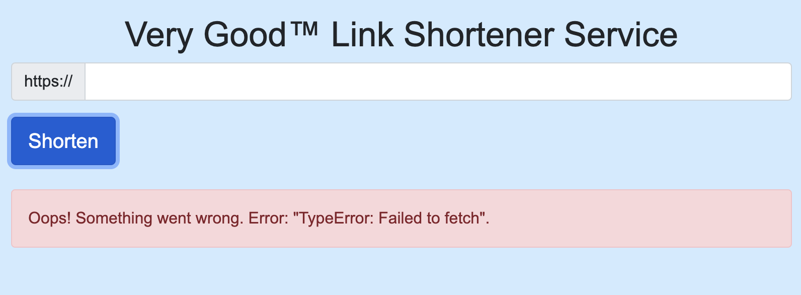

# Backends I: Servers <!-- omit in toc -->

## Contents <!-- omit in toc -->

- [Learning Objectives](#learning-objectives)
- [Intro to Servers](#intro-to-servers)
- [Challenge 1: Building a HTML server](#challenge-1-building-a-html-server)
  - ["Hello World" from the backend](#hello-world-from-the-backend)
  - [Add another route](#add-another-route)
  - [A Dynamic Website](#a-dynamic-website)
- [Challenge 2: Link shortener](#challenge-2-link-shortener)
  - [Project](#project)
  - [Key Value Stores](#key-value-stores)
  - [Handling Forms](#handling-forms)
  - [Accepting Post Requests](#accepting-post-requests)
  - [Implementing CORS](#implementing-cors)
    - [Task](#task)
  - [Implementing Persistence](#implementing-persistence)
    - [Task](#task-1)
  - [Retrieving All Links](#retrieving-all-links)
    - [Task](#task-2)
  - [Additional Tasks](#additional-tasks)
- [Mastery quiz](#mastery-quiz)
- [Above & Beyond](#above--beyond)
- [Glossary](#glossary)

## Timetable <!-- omit in toc -->

| Time                | Focus                                                                                                                                                                                                                                                                                                                                   |
| ------------------- | --------------------------------------------------------------------------------------------------------------------------------------------------------------------------------------------------------------------------------------------------------------------------------------------------------------------------------------- |
| Monday morning      | Review materials on how backends work, the HTTP protocol.                                                                                                                                                                                                                                                                               |
| Monday afternoon    | Start [Challenge 1](#challenge-1-building-a-html-server): "hello world", rendering dynamic responses and rendering static files.                                                                                                                                                                                                        |
| Tuesday morning     | Complete [Challenge 1](#challenge-1-building-a-server), implement Nunjucks templating,                                                                                                                                                                                                                                                  |
| Tuesday afternoon   | Start [Challenge 2](#challenge-2-link-shortener), link shortener with form handling. dynamically                                                                                                                                                                                                                                        |
| Wednesday morning   | Finish [Challenge 2](#challenge-2-link-shortener), continue working on link shortener                                                                                                                                                                                                                                                   |
| Wednesday afternoon | Start [Challenge 3](#challenge-2-link-shortener): link shortener with form handling.                                                                                                                                                                                                                                                    |
| Thursday morning    | Finish implementation of link shortener, including data persistence & redirects.                                                                                                                                                                                                                                                        |
| Thursday afternoon  | Take the [Week 7 Mastery Quiz](./quiz.md).                                                                                                                                                                                                                                                                                              |
| Friday              | **If you scored more 9 or more in the Mastery Quiz** - Congratulations 🎉! You've mastered the concepts for this week. You can move on to the Above & beyond challenges.                                                                                                                                                                |
|                     | **If you scored less than 9 in the Mastery Quiz** - Take the time you need to review the concepts you're unsure about (the guidance in the Quiz answers will point you to the materials to review). Once you're comfortable with all the concepts in the quiz, you can move on to the Above & beyond challenges for any remaining time. |

## Learning Objectives

By the end of this week a learner will be able to

- Define the differences between a backend and a frontend
- List the benefits of the frontend and the backend
- List the different HTTP methods and when they should be used
- Describe the difference between common HTTP status codes
- Run a simple web server that delivers HTML upon request
- Load JSON into a variable using JavaScript
- Run a simple web server that delivers JSON upon request
- Parse a GET request using a backend framework
- Parse a POST request using a backend framework
- Handle form submissions
- Use a key-value pair store to hold data in memory
- Retrieve data from a key-value pair store and return it in JSON
- Describe what CORS is why it is important
- Use middleware to handle CORS errors
- Explain - at a high level - how the internet works

## Intro to Servers

So far when we've created HTML pages (e.g., `cv.html` last week) we've simply opened them from our filesystem. If you pay attention to the URL, you can see the address is something like `file:///Users/alex/blah/cv.html`:


We're accessing our files through the `file://` protocol, which allows us to see web pages on our machine's hard disk. The `file://` protocol isn't that useful beyond very basic testing though: no-one can visit our site if they're not physically using our machine!

You're more used to accessing pages via addresses like `http://example.com` or `https://facebook.com`. `http:` stands for Hypertext Transfer Protocol, with `https:` being it's successor Hypertext Transfer Protocol _Secure_. Unlike the `file://` protocol, these protocols allow us to read files on our local system _or_ over the internet.

When we visit a `http:` (or `https:`) URL, we are making a **HTTP request**. This request is handled by a **server** or **backend** (these terms are mostly interchangeable). The backend can choose how it wants to respond to our request in a host of different ways. It could:

- Respond with some HTML to render.
- Respond with something other than HTML, like an image or video.
- Redirect us to another URL.
- Respond with an [error code](https://developer.mozilla.org/en-US/docs/Web/HTTP/Status#Client_error_responses). (The most common error you've probably encountered is a [404](https://developer.mozilla.org/en-US/docs/Web/HTTP/Status/404), which means we've trying to access a URL which doesn't exist).
- Not respond at all. (This will eventually cause the browser to give up, triggering a HTTP timeout).

One other key part of the HTTP protocol is that the browser can send **HTTP request data** along with it's request. For example, when requesting `http://example.com/login` I might send my username and password as part of my request.

Backend development is all about creating the rules which dictate when and how a server should respond to requests. For example:

- When responding with HTML a backend could simply return the HTML from a static file. (For example, send the contents of `cv.html`). Alternatively we can use logic to construct HTML dynamically, as we'll see below.
- It's very common to use a database to dictate how to respond to requests. For example, my response to a request to `http://example.com/login` will probably depend on whether the username/password the browser sends matches what I have stored in my database.

For a bit more on how servers/backends work, watch the video below:


- [:link: - How The Backend Works](https://www.youtube.com/watch?v=4r6WdaY3SOA) (4 min watch)

<br>
<hr>
<br>

## Challenge 1: Building a HTML server

### "Hello World" from the backend

We have a very simple backend (`christmas/christmas_server.js`) to get us started:

```js
import { Application } from 'https://deno.land/x/abc@v1.3.1/mod.ts'

const app = new Application()
const PORT = 8080
const christmas = new Date(`December 25, ${new Date().getFullYear()}`)

app
  .get('/', (server) => {
    server.html('<h1>Hi world!</h1>', 200)
  })
  .start({ port: PORT })
console.log(`Server running on http://localhost:${PORT}`)
```

We're using the [Abc microframework](https://github.com/zhmushan/abc), and are able to create a simple backend with remarkably few lines of code. Test it out by running:

```
deno run --allow-net christmas_server.js
```

Navigate to http://localhost:8080 (you should also be able to Cmd + click the message in your terminal) and you should see a "Hello world!" message.

Try changing "Hello world" to "Hi world" and refresh your browser. What happens? Why do you think this is?

Whenever we make changes to our backend, we need to restart our server to see those changes take effect. We can do this manually: kill your program in Terminal (with Ctrl+C) and rerun `deno run --allow-net christmas_server.js`. However, it'll be a pain to keep doing this, so instead let's use a tool called `denon`, which will auto-reload our server when we make changes. Install `denon` by running:

```
deno install -qAf --unstable https://deno.land/x/denon/denon.ts
```

We can now run our server as before, substituting `deno run` with `denon run`:

```js
denon run --allow-net --allow-read christmas_server.js
```

<details>
  <summary>`denon` not working after restart?</summary>

If `denon` is not working after installation with the error message `command not found: denon` you may have to run this command:

```
echo 'export PATH="$HOME/.deno/bin:$PATH"' >> ~/.zshrc
```

</details>

Now try making changes to the `server.html()` call, and you should see them reflected immediately.

> **📝 Note**: Right now, the response from the server is literally just a `<h1>` tag - our page doesn't include a `<head>`, `<body>` etc. - it doesn't have the [anatomy of a valid HTML document](https://developer.mozilla.org/en-US/docs/Learn/Getting_started_with_the_web/HTML_basics#Anatomy_of_an_HTML_document). Luckily our browser still renders the page even though it's technically invalid, and for testing purposes rendering a `<h1>` in isolation like this is OK.

### Add another route

We can add additional 'routes' to our website by setting up more handlers.

Given what you know already and can infer from our existing code

1. Create a new route to the server at `/bye`
2. Edit the response so that your website says `Goodbye World`

### A Dynamic Website

Now we'll try creating a dynamic response which is different every time we load the page. Let's display the number of days, hours and minutes until Christmas. We'll create a `timeUntilChristmas()` method, which should return a string with the days, hours, and minutes until Christmas. We'll then call that when we render our `<h1>`:

```js
app.get('/', (server) => {
  server.html(`<h1>It's ${timeUntilChristmas()} until Christmas</h1>`, 200)
})
```

We can use he [`date-fns`](https://date-fns.org/v2.15.0/docs/Getting-Started) library, which can help with our `timeUntilChristmas()` implementation.

In particular the functions below may come in handy

- [`intervalToDuration`](https://date-fns.org/v2.15.0/docs/intervalToDuration) and
- [`formatDuration`](https://date-fns.org/v2.15.0/docs/formatDuration)

We'll also import [`format`](https://date-fns.org/v2.15.0/docs/format) for later):

```js
import {
  intervalToDuration,
  formatDuration,
  format
} from 'https://deno.land/x/date_fns@v2.15.0/index.js'
```

You should read the documentation for the above functions and implement them.

The end result should look like this:


Crucially, if we wait a minute and refresh the page, we should see a different response (you can also include seconds in your `timeUntilChristmas()` to have the page change on each request). Our backend is using logic to create a response based on some changing data - in the case, the current date & time - but the exact same principles apply if we're, say, reading data from a database.

## Challenge 2: Link shortener

For simple websites, we can create them by building servers set sends HTML directly to the browser. This will work for a while but it means that we can't write apps using helpful frameworks such as React.

To be able to build websites that use Front End technologies we'll want to be building servers that act as APIs. For the rest of this week we'll be doing just this.

### Project

For this challenge, we'll be building a simple URL shortener similar to [bit.ly](https://bitly.com/). Users will enter a long URL like:

```
https://example.com/some-long-inconvenient-url-the-user-wants-to-shorten
```

And they'll get a URL like:

```
http://localhost:8080/l/f8Vj
```

Visiting the latter URL will redirect to the former.

### Key Value Stores

A key-value store, is very similar to how we'd use an [Object](https://developer.mozilla.org/en-US/docs/Learn/JavaScript/Objects/Basics) in JavaScript, in that it associates keys (usually short strings) with values. For example, in JavaScript, if I wanted to keep track of different currencies' value in USD, I might create an object like this:

```js
currencies = {
  YEN: 0.0094,
  GBP: 1.31,
  CAD: 0.76
}

console.log('£1 is worth $' + currencies['GBP'])
```

With the same data stored in a key-value we would queries the value associated with the `"GBP"` key, and get back the value `1.31`:

<br>

<br>

> **❓ Question:** If a key-value store is like an Object in JavaScript, why not just stick to using Objects? Data that's created by JavaScript (in the form of Objects, arrays, strings etc.) is generally held in memory, and only exists for the life of the process. If our server process terminates, that data is lost! On the other hand, a key-value store should reliably persist our data. Additionally, production-grade key-value stores like Facebook's [RocksDB](https://en.wikipedia.org/wiki/RocksDB) come with a wealth of features like automated backups, integrations with other databases and programming languages, and lots of performance optimizations.

We can also associate more complex data with a key. For example, imagine a key-value store which tracks vehicle data, using license plate numbers as the keys:

<br>

<br>

In this case we actually have three pieces of information in the returned value: the car's color, year model. We're not using any particular data format here, we're just separating the parts with whitespace - but we could just easily return a YAML or JSON string.

### Handling Forms

For this project, you're given a simple starter React app (with our familiar styling):


As always, you can start by customizing the look and feel as you prefer. To get the app setup you should:

1. Navigate to the app in `/link_shortener`.
2. Go ahead and run `yarn install`
3. and `yarn start`
4. This should then open `http://localhost:3000/` where you can see your website.

Try filling in the form, you should see an error like this:



Let's examine the code in our `App.js` file to see what our next step should be:

```js
async handleSubmit(event) {
  event.preventDefault()

  const url = `https://${this.state.value}`

  try {
    const response = await this.postData(
      'https://localhost:8080/shortlinks',
      {
        fullUrl: url
      }
    )
    if (response.status >= 400 && response.status < 600) {
      throw new Error('Bad response from server')
    }

    if (response.success) {
      this.setState({ success: true, value: '', code: response.code })
    } else {
      this.setState({ success: false, error: response.error })
    }
  } catch (error) {
    this.setState({ success: false, error: error.toString() })
  }
}
```

When we submit our form, our browser will make a `POST` request to `/shortlinks`.

As we've covered earlier `POST` requests are commonly used when sending data from a form (particularly when that form "creates" something new, like a new user or in this case a new shortened URL).

You can watch a short refresh on to the different methods in HTTP below:


- [:link: - Http Methods](https://www.youtube.com/watch?v=guYMSP7JVTA) (5 min watch)

### Accepting Post Requests

We've made a simple server for you in `list_shortener/server.js` to build your API server for the rest of this Challenge.

We'll need to create a handler for `app.post('/shortlinks')`. The data we send from our form will be available via `abc`'s `.body` getter method. `body` will return an Object, so for debugging purposes, let's return the URL that was submitted to us.

```js
.post('/shortlinks', async (server) => {
  const body = await server.body
  const url = body.fullUrl
  server.json({url: fullUrl}, 200)
})
```

When this is working, you should be able to run your React app and submit a url. Give it a try now...

Here's the result:


Oh no! Looks like something is still wrong - let's take a look at our console to see what's gone wrong...

> Access to fetch at 'http://localhost:8080/shortlinks' from origin 'http://localhost:3000' has been blocked by CORS policy: Response to preflight request doesn't pass access control check: No 'Access-Control-Allow-Origin' header is present on the requested resource. If an opaque response serves your needs, set the request's mode to 'no-cors' to fetch the resource with CORS disabled.

Looks like we've got a "CORS" error, let's take a look at what that means

### Implementing CORS

Once you've made the above changes, try to `POST` data from

> Access to fetch at 'http://localhost:8080/shortlinks' from origin 'http://localhost:3000' has been blocked by CORS policy.

We've run into a dreaded **CORS** error. CORS is a key security policy enforced by browsers, but why have we only run into it now? Well for the first time, we have our own backend and frontend running separately. Currently, they're running on different ports (as shown in the diagram below), but they could just as easily like on entirely separate domains (as we'll see when we get to the deployment stage).

<br>


To get a deeper understanding of CORS, watch the video below:


- [:link: - What is CORS?](https://www.youtube.com/watch?v=UjozQOaGt1k) (15 min watch)

Luckily, fixing our CORS issue is easy with `abc`. Let's give it a try now

#### Task

In this task we're going to investigate what CORS is and how we can write a policy that is maximally permissive to allow all the requests that our API receives.

It's worth noting that in this approach, we'll have sidestepped the issue by using a default CORS policy: allowing all origins. That's not a problem for the moment, where we're only serving unauthenticated, public data, but it will represent a security hole once we start serving user-specific data too. Don't worry, we'll tighten up our CORS policy later in the course.

1. Research CORS
   - What is the problem it's trying to solve?
2. Read the CORS Library Documentation
   - https://github.com/tajpouria/cors
   - https://github.com/tajpouria/cors/tree/master/examples/abc
3. Implement a CORS policy to let your API work with your frontend

<details>

  <summary>
    Click here for a hint
  </summary>

Hint: you'll want to make sure that these CORS headers are attached

```js
allowedHeaders = [
  'Authorization',
  'Content-Type',
  'Accept',
  'Origin',
  'User-Agent'
]
```

and

```js
credentials = true
```

</details>

You'll know when CORS is configured correctly as you'll be able to retry your `fetch` and everything should now be working OK.

### Implementing Persistence

We're now ready to create our simple link shortener. First let's import [`store`](https://deno.land/x/store@v1.2.0), the simple key-value store we'll be using:

```js
import { Store } from 'https://deno.land/x/store@v1.2.0/mod.ts'

const store = new Store('shortenings')
```

`Store` works by accepting a key and a value inside `.set()`. For example

```js
store.set('d7Vj', 'https://www.sigmalabs.co.uk')
```

Would set the key to `d7Vj` and the value to `https://www.sigmalabs.co.uk`.

#### Task

1. Create a function `randomShortcode()` that will create a random four letter string for our keys
2. Fill in your `POST` handler so that whenever a new `fullUrl` is received we generate a new shortcode
   - Ensure you validate the URL that is submitted by the user. Is it present? Is it a valid url?
     - If not, return an error message and an appropriate error code
3. Store the shortcode and URL in a new instance of `Store`

### Implementing Re-directs

Next, we'll implement the route handler for our shortened URL.

In the first parameter of our shortcode endpoint - the `path` parameter - we can use a `:` to denote when a path is going to change depending on what the user is accessing. For example:

```js
app.get('/l/:shortcode', (server) => {
  // shortcode taken from the URL
  const { shortcode } = server.params

  server.redirect('https://example.com')
})
```

In this example, the variable `shortcode` would contain the value `f7YD` if the user requested data from the `/l/f7YD`. If they requested data from `/l/sigmalabs` is would contain the value `sigmalabs`.

You should complete the handler above, so that we fetch the full URL dynamically from our key-value store.

1. Add a new `GET` endpoint with the route `/l/:shortcode`
2. Extract the shortcode from the server params
3. If the shortcode has an associated URL, then redirect the user to that URL

### Retrieving All Links

Next, let's add functionality to our front and back end that allows users to see all of the shortened links.

To be able to view all of the URLs that have been saved to be redirected we'll need to create an endpoint that returns every saved URL and its shortcode.

When you've created a new endpoint, edit the React app in `/link_shortener/` to fetch the data from this endpoint and display it in the browser.

#### Task

1. Create a new `GET` endpoint called `/urls`
2. Add functionality that will return all of the stored URLs and shortcodes in a JSON array
   - Make sure you return the correct response code for a successful query
3. Add a function in your React app to fetch the data from your new endpoint
4. Render the data in your React app

### Additional Tasks

With this in place we have a fully functioning link shortener - congratulations :tada:!

However, there's still some more polishing to do...

1. Error Handling
   - What happens if someone visits http://localhost:8080/ABC123, but `"ABC123"` isn't in our key-value store?
2. Visit Tracking
   - Lots of link shortening services offer functionality whereby you can see how many times your shortened link was accessed.
   - To implement this, as well as storing the full URL under the key, say, `"f8Vj"` we'd store a counter (starting at 0) under the key `"f8Vj.visits"`.
   - Whenever we access the URL (through the `app.get("/l/:shortcode")` handler) we increment the value in our key-value store under the `"f8Vj.visits"` key.
   - We should also create a endpoint (e.g. `http://localhost:8080/visits/fAk3`) which returns a JSON object containing the number of visits.
   - Finally, update our React App to show how many times the URL has been visited
3. Private Shortened URLS
   - When a user submits a URL to be shortened it is automatically made public on the front page of the URL Shortener Website
   - Add a checkbox that allows the user to mark their submission as private
   - When fetching the submitted URLs, only return ones that are not marked as private
4. Delete Shortened URLs
   - Add an endpoint to delete an endpoint from being supported by your server
   - Make sure to use the [`DELETE`](https://developer.mozilla.org/en-US/docs/Web/HTTP/Methods/DELETE) HTTP Method to do this.
     - e.g. Sending a `DELETE` request to `http://localhost:8080/fAk3` will delete the redirect from the server.
   - If the shortcode cannot be found, then you should return an error and an appropriate error code

<hr>

## Mastery quiz

Once you've completed the core project, have a go at the [Mastery Quiz for this week](quiz.md). If you score 90% or more, carry on with the **Above and beyond** challenges below. Otherwise, take the time to review the materials for the questions you got wrong.

<hr>

## Above & Beyond

Congratulations on building your first backend from scratch!

The best course of action from here is to continue to create other backends that achieve different tasks. You can find a set of challenges here.

[Backend Challenges](https://github.com/Sigma-Labs-XYZ/Backend-Challenges)

Push yourself to try as many of them as you can in the time that you've got

## Glossary

- **Backend/server** - In the context of web development, a backend or server handles incoming requests from clients and chooses how to respond. Often clients and servers communicate over a computer network on separate hardware, but both client and server may reside in the same system.
- **Client** - A client makes requests to a server. In the context of web development, usually a client is a web browsers, but it could also be, for example, a mobile application.
- **Dynamic** - A dynamic web page is a web page which is constructed by a server when a request is made.
- **`GET`** - Requests using the GET method should only retrieve (read) data.
- **Handler** - A handler is a function that defines how a server should respond to requests to a particular URL.
- **HTTP** - HTTP is a way of formatting and transmitting messages on the internet, designed for communication between web browsers and web servers.
- **HTTP methods** - HTTP defines a set of request methods to indicate the desired action to be performed. For example making a `GET` request to `http://example.com/posts/42` indicates you want to retrieve the post with ID 42, whereas a `DELETE` request to `http://example.com/posts/42` indicates you want to delete that post. The most common methods are `GET`, `POST`, `PUT` and `DELETE`
- **Interpolate** - Replacing placeholders with some value at runtime.
- **Localhost** - Localhost refers to the local computer that a program is running on. Addresses of the form http://localhost:8080 allow us to access a server running on our machine.
- **Parse** - Breaking something down into meaningful parts. Often this means turning an input from a string to some other data type.
- **POST** - The POST method is used to submit data to the server, usually to the creation of a resource (e.g. a new message, a new user, a new order etc.).
- **Request** - HTTP requests are messages sent by the client (the browser) to initiate an action on the server.
- **Request data** - Additional information send by the client along with the requested URL.
- **Response** - The answer from the server for a particular request.
- **Route** - A rule to help match requests to a particular handler. A route will usually match against at the URL and HTTP method of the request. Routes might contain wildcard patterns (e.g. `/user/:name`) or special logic.
- **Static** - The content of a static web page doesn't change. It's usually just a file which is sent unchanged by the server to the client.
- Cascading - The process of combining several style sheets and resolving conflicts between them. Conflicts are primarily resolved by always choosing the most specific selector.
- Chrome DevTools - Chrome DevTools is a set of web developer tools built directly into the Google Chrome browser. DevTools can help you edit pages on-the-fly and diagnose problems quickly.
- Class selector - A CSS class selector `.classname` targets all elements whose `class` attributes include `classname`. For example the rule `.camouflage { color: green }` would make both the elements `<span class='camouflage>` and `<h1 class='title camouflage'>` green.
- CSS (Cascading Style Sheets) - CSS is a language used to define styles for your web pages, including the design, layout and variations in display for different devices and screen sizes.
- CSS rule - A CSS rule is made up of a selector, followed by one or more pairs of CSS properties and values.
- CSS property - A CSS property is a characteristic (like color) whose associated value defines one aspect of how the browser should display the element.
- CSS selector - A CSS selector is the part of a CSS rule that describes what elements in a document the rule will match. The matching elements will have the rule's specified style applied to them.
- CSS value - The value is what the chosen CSS property will be changed to. For example in `color: #000`, `#000` is the value we assign to the color property.
- DOM (Document Object Model) - The DOM is an object-based representation of the source of a HTML document. We manipulate the DOM to change the structure of a HTML page using JavaScript.
- Element - An HTML element is an individual component of an HTML document. Most HTML elements are written with a start tag (or opening tag) and an end tag (or closing tag), with content in between.
- Events - Events are actions or occurrences that happen in the system you are programming, which the system tells you about so you can respond to them in some way if desired. Common events in a web context include page loads, clicks, key presses or form submissions.
- Event listeners - An event listener is a procedure or function in a computer program that waits for an event to occur, and responds accordingly.
- Flexbox - Flexbox is a new layout mode in CSS3. Flexbox tries to create the best possible layout for our items, giving bigger items more space and smaller items less space, thus preserving readability of content.
- HTML (Hypertext Markup Language) - HTML is the standard markup language for documents designed to be displayed in a web browser.
- ID selector - In CSS, an ID selector targets a single element based on its unique `id` attribute.
- Specificity - Specificity is the means by which browsers decide which CSS property values are the most relevant to an element and, therefore, will be applied.
- Type selector - In CSS, a type selector targets all elements of a given type. For example, the rule `p { color: red }` would make all `<p>` elements red by default (this could be overridden by a more specific selector).
- Web font - Web fonts are a CSS feature that allows you to specify font files to be downloaded along with your website as it is accessed, allowing you to effectively embed custom fonts in your HTML pages.
- Abstract class - An abstract is a class which cannot be instantiated, meaning you cannot create new instances of an abstract class. The purpose of an abstract class is to be a base for subclasses.
- Class - A class is a blueprint that defines a nature of a future object. Classes define properties and methods for these future objects.
- Constructor - The constructor method is a special method of a class for creating and initializing an object of that class.
- Don't Repeat Yourself (DRY) - A mantra that says we should avoid having the same piece of code copy-pasted in a lot of different places when working on a particular codebase.
- Error/Exception - An error or exception is an event, which occurs during the execution of a program, that disrupts the normal flow of the program's instructions.
- Getter - A method that is called when a property is read.
- Inheritance - Inheritance is a mechanism in which one class (the child class or subclass) acquires the properties and methods of another class (the parent class or superclass).
- Instance - An instance is the concrete occurrence of a class. For example, if the `Card` class is the blueprint for any playing card, then the Ace of Spades is a instance of `Card` (it's a concrete example of a playing card).
- Instantiate - Instantiation is the process of taking a class definition and creating an object that you can use in a program.
- Methods - A method is a programmed procedure that is defined as part of a class and included in any object of that class.
- Object-oriented programming (OOP) - Object-oriented programming (OOP) is a programming paradigm based on the concept of "objects", which can contain data, in the form of properties, and code, in the form of methods.
- Polymorphism - Polymorphism describes a pattern in object oriented programming in which classes have different functionality while sharing a common interface.
- Properties - A property is a characteristic of an object, often describing attributes associated with what it's modelling in the real world.
- Refactoring - The process of changing code in such a way that it does not alter the external behavior of the code yet improves its internal structure.
- Setter - A method that is called when a property is written.
- Subclass - The class that inherits from another class.
- Superclass - The class being inherited from.
- Test driven development (TDD) - an evolutionary approach to software development which combines test-first development where you write a test before you write just enough production code to fulfill that test and refactoring.
- Validation - Validation is an automatic computer check to ensure that the data entered is sensible and reasonable.
- Array - An ordered collection/list of items.
- Command line interface (CLI) - A text-based interface that is used to operate software.
- Loop - A loop is a sequence of instructions that is continually repeated until a certain condition is reached.
- JavaScript - JavaScript is a programming language commonly used in web development.
- Pseudorandomness - Behaviour that, although produced by a completely deterministic and repeatable process, is seemingly unpredictable and appears have no pattern.
- Runtime - A runtime system that provides an environment in which programs run. Runtime systems are the bridge between the code you write and your machine's operating system.
- Seed - A special number used to reproduce the data given by a pseudorandom number generator.
- Switch statement - A switch statement checks the value of a variable and compares it with multiple cases. Once the case match is found, a block of statements associated with that particular case is executed.
- Testing - Checking by means of actual execution whether a program behaves in the desired manner.
- Array - An ordered collection/list of items.
- Command line/Command line interface (CLI) - A text-based interface that is used to operate software.
- Conditional - A conditional statement tells a program to execute different actions depending on whether a condition is true or false. For example: "if the account balance is less than 0, freeze the account" is an example of a conditional statement.
- Floating point number/float - A number with a decimal point.
- Function - A named section of a program that performs a specific task.
- Git - The most popular version control system.
- Github - A popular platform for hosting Git repositories.
- Integer - A whole number.
- JavaScript - JavaScript is a programming language commonly used in web development.
- Object - JavaScript's Object data type associates names (or keys) with values. For example, the object `{ 'Johnson': '+440773141214', 'Lewis': '+4141915901' }` associates surnames and telephone numbers.
- Pipes - A pipe is a technique for passing information from one program process to another. For example the command `ls -1 | wc -l` passes the result of `ls` program to the `wc` program to count the number of files in the current directory.
- Program/script - A program is a set of instructions that a computer follows in order to perform a particular task. For a language like JavaScript, Python, and Ruby which can execute programs from just the source code, a "script" is the same as a "program".
- Repository/repo - A (Git) repository tracks all the files and changes for a single project.
- Unix - The operating system that forms the basis of Linux and macOS (but not Windows). Most web servers run on Unix environments, so Unix environments are usually preferred to Windows by web developers.
- Version control - Version control is a system that records changes to a file or set of files over time. By carefully recording changes, version control systems let you undo mistakes, compare versions of a program, and work on a codebase in a team without your changes overriding those of your colleagues.
