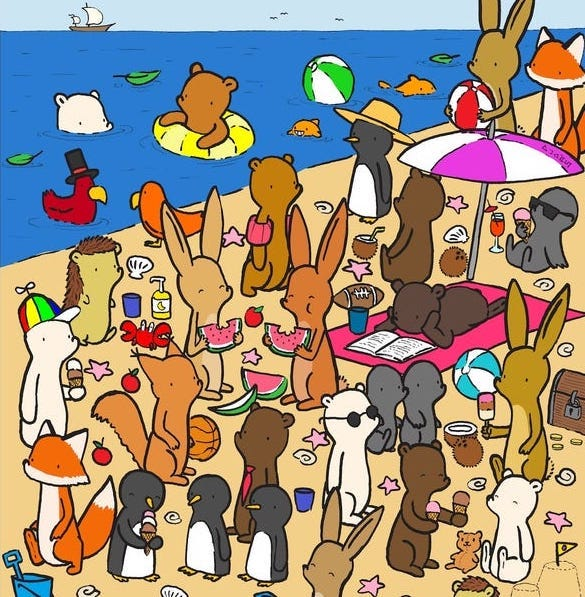
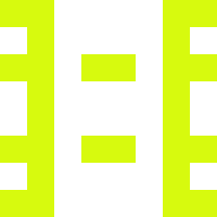

# Password hashing

## Learning Objectives

- Understand why we don't store passwords in plaintext
- Define what a hash function is
- List the key properties of a cryptographically secure hash function
- Use the `bcrypt` library in Deno to generate and compare (salted) hashes

## Pre-work

### Setup

If you haven't already, create a thread in the #workshops channel called 'Week 9: Hashing Pre-work'.

### Exercise

- Define what 'hashing' is?
- Why do we need to hash?
- What is the problem with not having a hash output of a fixed size?
- Define the term 'salt' and 'pepper' in a cryptography context.

Share your answers in the above thread.

## Workshop

### Discussion

Differentiate the difference between Encryption, Encoding and Hashing.

Make sure that you drive how the major difference is that Hashing is unidirectional

### Live Coding

Use the `md5sum` command line tool to get the hash (checksum) of a file (e.g. the `README.md` for this week). Make a small change to the file and notice how the hash changes completely.

Challenge the students how to explain how we could use the `md5sum` to check whether a password a user provided was the same password they entered when registering _without_ storing their password in plaintext.

Next, discuss why MD5 [isn't suitable](https://en.wikipedia.org/wiki/MD5#Security) for encrypting passwords in a real-world application.

### Demo

One important aspect of hashing is that it makes it very easy to spot differences between two images.

Challenge the students to spot the difference between them and then run an MD5 check on it to show that they are distinct

    
    

### Demo

Load up Terry Kwon's visual hash generator:

https://terrykwon.com/blog/visual-hashing/

Run through some demo inputs to demonstrate that the generator has some interesting properties:

- An input of any length will generate the same sized image
- Different inputs generate different hashes
- A small change to the input (in all likelihood) leads to a large change in the output
- Given a generated image, you can't work out what input was used to create it

To hammer home the last point, give students 5 minutes to try and find an input to generate the image below:

If you're feeling brave, bet the students £50 that they won't be able to find an input that generates the exact image above 🤑!

### Live Coding

Next, load in `bcrypt` in the Deno REPL (or write a small `.js` program) to demonstrate:

- Generating a hash for `sigmalabs123` with some salt (e.g. "foo")
- Generating a hash for `sigmalabs123` with a different salt (e.g. "bar"). Note that they yield different hashes.
- Show that both hashes match against `sigmalabs123` (`await bcrypt.compare("sigmalabs123", hash1)`)
- Show that the hashes don't match with another input (`await bcrypt.compare("sigmalabs321", hash1)`)

(Note that you'll need to run Deno with `--unstable`)
